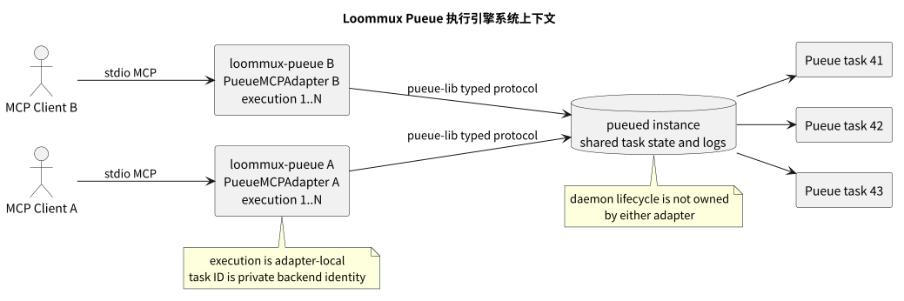
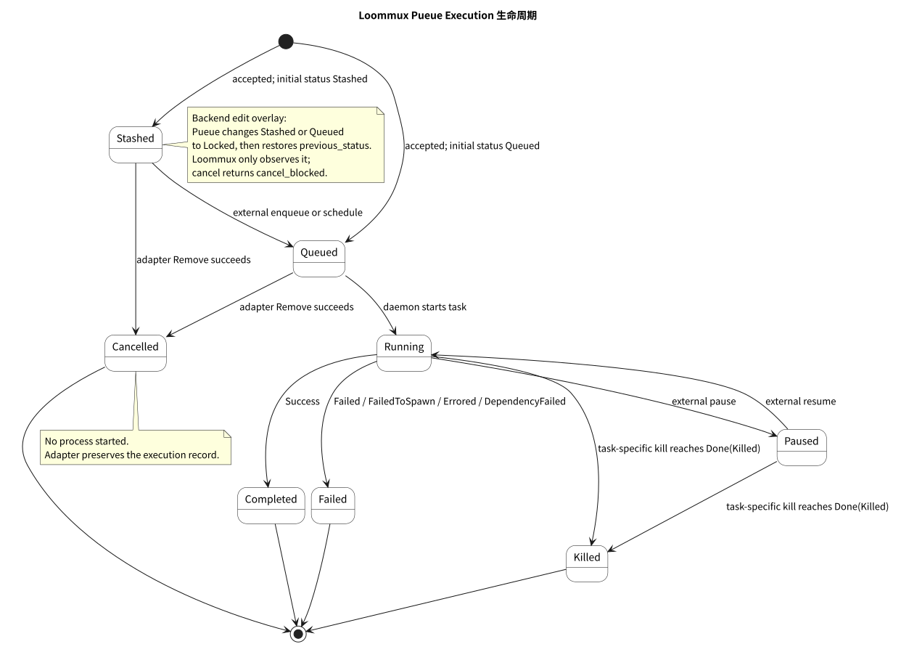

= Loommux Pueue 执行引擎设计规格
:doctype: book
:toc: left
:toclevels: 3
:sectnums:
:sectnumlevels: 4
:icons: font
:source-highlighter: rouge
:xrefstyle: short
:experimental:

[abstract]
本文定义 Loommux Pueue 执行引擎第一阶段目标的系统身份、对象模型、状态空间、公共工具、执行语义、输出投影、生命周期、失败表面和实现边界。本文同时记录形成这些规格的设计决定；第一阶段实现、测试、工具描述、交付计划和发布文档不得定义与本文冲突的目标行为。

[#document-authority]
== 文档地位

本文是 Loommux Pueue 执行引擎的设计事实源。文中的“必须”“不得”和“仅”表示规范要求；“应”表示除非出现本文尚未涵盖且可被证明的约束，否则必须遵守的要求；“可以”只表示不改变公共契约的实现自由度。

本文定义 phase-one target，不声称该 target 已存在于当前代码。当前 implemented baseline 与目标迁移关系由 xref:index.adoc#package-status[文档包状态]和 xref:evidence-register.adoc#evidence-loommux-migration[EVD-LOOMMUX-004]限定；实现完成状态只由 xref:phase-1-delivery-plan.adoc#stage-gates[阶段门]和系统验收证据决定。

本文所称“Pueue 执行引擎”不是 Pueue daemon 本身，而是 Loommux 在 MCP client 与一个既有 Pueue daemon 之间建立的 execution control plane。Pueue 继续拥有 task 调度、进程管理、状态持久化和 task log；Loommux 拥有 agent 可寻址的 execution、MCP 工具语义、输出文本投影和有界观察。

本文不以讨论时间顺序表达设计。被后续结论替代的方案只出现在“替代方案与拒绝理由”中。原始聊天记录可证明设计讨论提出过某项主张，但不能证明外部软件、协议或运行时具有某项行为。外部技术断言必须由 xref:evidence-register.adoc#evidence-policy[证据登记规则]定义的来源支持。

第一阶段的工作分解、依赖关系和验收门见 xref:phase-1-delivery-plan.adoc#delivery-authority[第一阶段交付计划]。文档制品自身的完成标准见 xref:documentation-quality-standard.adoc#documentation-authority[文档质量标准]。

[#scope]
== 适用范围

[#problem-world]
=== 问题世界

coding agent 通过离散 MCP 请求工作。它提交一段程序，读取一次工具响应，根据响应决定下一次调用。它不持续观看一个终端屏幕，也不能依赖人工输入、光标位置、颜色、分页器或某个仍然附着的 shell session 维持执行控制。

长时间 shell 工作与一次 MCP 调用的生命周期不同。构建、测试、下载、转换和服务进程可能超过调用方愿意同步等待的时间。控制面因此必须在一次提交调用返回以后，继续为同一个执行实体提供稳定地址、状态观察、日志读取、日志搜索、再次等待和定向取消。

Pueue 已经提供持久 daemon、task ID、队列、并行度、task 状态、task result、日志和进程控制。Loommux 不重复实现这些能力。Loommux 在其上增加的是面向单个 MCP client 的 execution namespace，以及与现有 IPython engine 同构但适配 Pueue 并发模型的控制原语。

[#intended-consumer]
=== 目标消费者

目标消费者是通过 MCP 提交和观察 shell 工作的 coding agent。人类交互式 shell、TTY 模拟器、作业调度管理界面和 Pueue 管理控制台不是本文定义的消费者。

目标消费者提交的是完整 shell script，而不是 argv 数组或必须由调用方拼接的单行命令。script 中的换行、管道、重定向、shell compound command 和注释由 Pueue daemon 配置的 shell 解释。

[#scope-boundaries]
=== 责任边界

Pueue 执行引擎负责：

* 将一个有效提交接受为 adapter-local execution；
* 将 execution 绑定到一个 daemon-global Pueue task；
* 将 Pueue task 状态投影为稳定的 Loommux execution 状态；
* 将 Pueue combined task log 投影为可重复读取和搜索的普通文本；
* 在有限调用等待预算内观察 task，而不把等待超时解释为任务超时；
* 对一个明确 execution 发送取消请求；
* 在 adapter 生命周期内保存 execution 地址和观察状态。

Pueue 执行引擎不负责：

* 启动、关闭、重置或升级共享 `pueued`；
* 重写 Pueue 的调度、group、dependency、priority 或持久状态模型；
* 模拟 TTY screen 或提供交互式 stdin session；
* 为不受信任代码建立 sandbox、权限系统或多租户隔离；
* 将不同 task 伪装成共享 shell namespace；
* 管理 MCP adapter 未创建的任意 Pueue task；
* 保证 adapter 关闭后仍能通过已经失效的本地 execution 地址恢复控制。

这些边界由对象所有权决定，不是按开发成本裁剪出的功能列表。

[#terminology]
== 术语与受控词汇

[cols="1,3,3", options="header"]
|===
|术语 |定义 |不得混同的对象

|engine
|Loommux 所包装的底层执行系统及其适配边界。本文中的 engine 是 Pueue。
|不得等同于 adapter 或 MCP server process。

|adapter
|一个 `loommux-pueue` server process 中维护 execution namespace、映射和工具语义的有状态控制面对象。
|不得等同于共享 Pueue daemon。

|execution
|由一个 adapter 分配的正整数公共地址，作用域为该 adapter 生命周期。
|不得等同于 Pueue task ID、OS PID 或 shell exit code。

|execution record
|保存一个 execution 的 task 绑定、状态投影、时间、结果和输出观察状态的 adapter-local 记录。
|不得成为原始 MCP 请求或 shell source 的永久档案。

|task
|由 Pueue daemon 持有并调度的真实工作实体，使用 daemon-global task ID 标识。
|不得直接成为 agent 的公共 execution namespace。

|daemon instance
|由一个 Pueue profile、配置、secret 和连接地址确定的 `pueued` 实例。
|不得笼统表述为整台机器上唯一的 daemon。

|active execution
|状态尚未进入终态且 backend presence 仍为 present 的 execution，包括 locked、stashed、queued、running 和 paused 投影。
|不得缩减为仅 running execution。

|terminal state
|execution 已观察到 Pueue `Done` 结果，或已由本 adapter 确认取消的状态，包括 completed、failed、killed 和 cancelled。
|不得把等待调用返回视为 terminal state；已观察到的终态 record 不跟随不受支持的 backend in-place restart 重新打开。

|observation
|读取 task 状态或输出而不改变 task 的操作。
|不得与 wait、MCP 请求完成或 task 完成混同。

|combined transcript
|Pueue 写入单个 task log 的 stdout/stderr 合并字节序，经 Loommux terminal text normalizer 处理后的 append-only 文本投影。
|不是终端 screen，也不承诺还原独立 stdout/stderr 流。

|initial wait
|`run_shell` 接受 task 后，在同一次 MCP 调用中使用的有限观察预算。
|不是 task runtime limit。

|cancel
|针对一个明确 execution 删除最近观察为 queued/stashed 的 task，或请求 Pueue 终止其已有进程的 Loommux 控制原语。
|Remove success 建立 cancelled 控制终态，但不证明 refresh/remove 竞态期间未出现 backend terminal result；Kill request 被接受不等于 task 已经进入 killed 终态。
|===

公共文档统一使用 `execution`、`task`、`adapter`、`daemon` 和 `combined transcript`。不得使用“进程编号”指代 execution，不得使用“当前任务”指代多个 active execution 中的某一个，也不得使用“超时”而不说明是 MCP observation timeout 还是 task 自身行为。

[#system-facts]
== 约束事实

[#loommux-control-model]
=== Loommux 控制模型

现有 IPython engine 已建立下列稳定控制关系：

[source,text]
----
public execution coordinate
    -> backend execution entity
    -> lifecycle state and output events
    -> status / read / search / wait / control
----

该关系独立于 IPython 的具体消息类型。engine adapter 分配公共 execution，底层执行系统拥有真实执行实体，MCP 工具围绕 execution 提供创建、观察和控制。Pueue engine 必须保留这条关系。

IPython engine 的唯一 `current_execution`、`interrupt` 无参数选择和 `restart` 来自单 kernel 及其所有权，不属于跨 engine 不变量。Pueue engine 不复制这些 IPython 专属表面。

[#pueue-facts]
=== Pueue 执行事实

Pueue daemon 维护 task 表。一个 task 具有 task ID、command、working directory、environment、group、dependency、priority、label 和 `TaskStatus`。Pueue `v4.0.4` 的 `TaskStatus` 包含 `Locked`、`Stashed`、`Queued`、`Running`、`Paused` 和 `Done`；`Done` 携带 `Success`、`Failed(exit_code)`、`FailedToSpawn(message)`、`Killed`、`Errored` 或 `DependencyFailed` 结果。对应证据见 xref:evidence-register.adoc#evidence-pueue-task-model[EVD-PUEUE-002]。

一个 daemon instance 可以同时被多个 client 连接并持有多个 queued 或 running task。instance 由 settings、secret 与 connection 共同确定，见 xref:evidence-register.adoc#evidence-pueue-settings[EVD-PUEUE-008]。不同 task 不共享一个持续 shell namespace；每个 task 的 command 由 daemon 配置的 shell 独立执行。

Pueue task ID 在 daemon state 中标识 task。它不表达创建该 task 的 MCP client，也不从每个 MCP client 的 `1` 开始。因此它不能直接替代 adapter-local execution。

Pueue 将 stdout 和 stderr 的文件句柄指向同一个 task log 文件。该文件构成 Pueue 的合并日志事实；Loommux 不在该事实之上伪造可精确分离的 stdout 和 stderr 历史。对应证据见 xref:evidence-register.adoc#evidence-pueue-log-model[EVD-PUEUE-004]。

Pueue protocol 没有独立的 `Wait` request。Pueue CLI 的 wait 通过重复读取 state、判断目标状态并在轮询之间休眠实现。Loommux 的有界等待必须采用同一类观察算法，同时增加 MCP deadline。对应证据见 xref:evidence-register.adoc#evidence-pueue-wait[EVD-PUEUE-003]。

Pueue 的 queued task 可以因 process spawn 失败或 dependency 失败直接进入 `Done`，不必先进入 `Running`。Pueue `4.0.4` 还允许 task-specific start 强制启动 stashed task；该 task 可以直接进入 `Running`，也可以在 process spawn 失败时直接进入 `Done(FailedToSpawn)`。in-place restart 保留 task ID，将 `Done` 重置为 queued 或 stashed，并可替换 command、path、label 和 priority；后续 spawn 会重新创建同一 task ID 的 log。successful remove 同时删除 task state 和该 task 的 log。对应证据见 xref:evidence-register.adoc#evidence-pueue-generation[EVD-PUEUE-009]和 xref:evidence-register.adoc#evidence-pueue-patch-delta[EVD-PUEUE-010]。

Pueue `4.0.4` CLI 会 canonicalize 显式 `add --working-directory`，但该逻辑位于 CLI request construction，不属于 typed `AddRequest` 或 daemon validation。Pueue daemon 的 Unix task process 由 `process-wrap v9` 的 process-group leader 管理；Windows 使用 Job Object。Loommux 直接构造 typed request，因此必须自行保证 `AddRequest.path` 是 canonical directory，并通过真实进程树测试验证目标 daemon 的 pause、resume 和 kill 边界。对应证据见 xref:evidence-register.adoc#evidence-pueue-patch-delta[EVD-PUEUE-010]。

[#derived-constraints]
=== 推导约束

由上述事实得到下列约束：

. 多个 adapter 共享 daemon instance，因此 adapter 不拥有 daemon 生命周期。
. 一个 adapter 可以同时拥有多个 active task，因此不存在唯一 `current_execution`。
. Pueue task ID 与 MCP client 身份无关，因此每个 adapter 必须维护自己的 execution namespace 和 task 映射。
. task 在 adapter 退出后仍可由 daemon 执行，因此 task 生命周期不能从属于 MCP stdio process。
. execution 映射保存在 adapter 内存中，因此 adapter 退出会使该本地地址失效。
. Pueue 日志是合并日志，因此公共输出对象必须是 combined transcript。
. Pueue wait 是状态观察，因此 observation timeout 不得向 task 发送控制请求。
. Pueue client 的请求与响应共享连接，因此单轮 protocol exchange 必须保持原子；轮询 sleep 不得持有连接锁。
. Pueue task ID 不携带运行 generation，因此 mapped task 的外部 in-place restart 不能作为原 execution 的正常生命周期转换。
. Pueue CLI 的 working-directory canonicalization 不属于 typed protocol，因此 adapter 必须在提交前 canonicalize 最终 workspace。
. daemon 持有 task 的受管 process-group 或 Job Object 控制，因此 adapter 不实现第二套 process control；目标平台仍必须使用明确 fixture 验证 task-specific control 的 descendant 边界。

这些约束共同决定后续系统结构和七工具控制闭环。

[#system-identity]
== 系统身份与命名

[#dec-pueue-001]
=== DEC-PUEUE-001：Loommux 下的 Pueue engine

决定::
Pueue 实现位于 `engines/pueue/`，Cargo package 与 binary 名为 `loommux-pueue`，Rust crate 名为 `loommux_pueue`。MCP server identity 使用 `Loommux Pueue execution engine`。

事实前提::
Loommux 的稳定身份是面向 coding agent 的 execution control plane；IPython 是既有 backend，Pueue 是本文的目标 backend。Pueue task 的被执行语言是 shell，但系统的持久状态、调度和日志来自 Pueue，而不是一个自行管理 child process 的普通 shell server。

逻辑推导::
名称必须同时表达项目身份与 backend 身份。`loommux-pueue` 能够与未来其他 engine 并列，并且不会把系统误写为 Pueue 的 fork 或通用 shell process manager。

拒绝方案::
`pueuemux` 丢失 Loommux 项目身份；`shell-mcp` 丢失 Pueue 所有权和持久 task 语义；独立顶层项目会使跨 engine control model、workspace 和工具语义失去共同事实源。

后果::
Python package 当前不因该决定改名。项目结构以 `src/loommux/` 保存既有 Python/IPython 实现，以 `engines/pueue/` 保存 Rust/Pueue 实现。

[#architecture]
== 系统结构

[#system-context]
=== 上下文关系

[source,text]
----
MCP client A                       MCP client B
     | stdio                            | stdio
     v                                  v
loommux-pueue A                    loommux-pueue B
PueueMCPAdapter A                 PueueMCPAdapter B
     | typed protocol                  | typed protocol
     +---------------+------------------+
                     v
              one pueued instance
                 /    |    \
              task 41 42   43
----

一个 `loommux-pueue` process 服务一个 MCP client，并创建一个 `PueueMCPAdapter`。多个 process 可以通过各自 Pueue client connection 连接同一个 daemon instance。共享发生在 Pueue task 层，不发生在 adapter-local execution namespace 层。

[#system-context-diagram]
.Loommux Pueue 执行引擎系统上下文

图中的共享边界位于 daemon task state；execution namespace、recent selection 和本地输出投影仍分别属于两个 adapter。

[#components]
=== 组件职责

[cols="1,3,3", options="header"]
|===
|组件 |拥有的对象 |不得拥有的对象

|MCP server
|stdio transport、工具注册、请求参数解码和结果编码。
|Pueue task state、execution 状态机、daemon 生命周期。

|`PueueMCPAdapter`
|execution sequence、execution map、recent execution、工具控制流程。
|Pueue 全局 task 表、daemon group policy、shell process。

|`PueueGateway`
|Pueue settings、secret、connection、单轮 request/response 原子性和 reconnect error surface。
|长时间 wait deadline、execution selection、MCP result formatting。

|`PueueExecution`
|execution ID、task ID、状态投影、时间、结果、output collector state。
|daemon 配置、其他 execution、原始 MCP request archive。

|`OutputCollector`
|task log offset、terminal normalizer state、combined `LineLog`。
|task lifecycle、Pueue protocol connection。

|workspace resolver
|launch cwd 与显式配置到工作目录的单次启动解析。
|shell 选择、task runtime cwd mutation、daemon data directory。

|`pueued`
|task、调度、进程、原始合并日志和持久 state。
|adapter-local execution、MCP request 和 Loommux output line coordinates。
|===

[#ownership]
== 对象所有权与生命周期

[#ownership-invariant]
=== 所有权不变量

所有可观察状态必须具有唯一拥有者：

[cols="2,2,2,3", options="header"]
|===
|对象 |拥有者 |生命周期 |公共观察方式

|workspace 与 resolution
|server process
|server startup 至退出
|`status`

|Pueue connection
|`PueueGateway`
|adapter startup 至关闭；断连可以产生替代 connection
|`status` 和稳定连接错误

|execution sequence 与 map
|`PueueMCPAdapter`
|adapter 生命周期
|七个工具

|execution record
|`PueueMCPAdapter`
|accepted submission 至 adapter 退出
|execution status、read、search、wait、cancel

|Pueue task
|daemon instance
|task 创建至 Pueue remove、clean 或 reset
|经 execution 映射间接观察

|shell process
|daemon task handler
|task running 区间
|task 状态和日志

|原始 task log
|daemon instance
|task log 创建至 Pueue 清理
|经 output collector 间接读取

|combined transcript
|execution record 的 output collector
|execution record 生命周期
|`read_output`、`search_output`、terminal result
|===

adapter 关闭时必须关闭 client connection 并释放本地记录；不得发送 daemon shutdown、reset、clean 或全局 kill。已经进入 daemon state 的 task 不因 adapter 关闭而自动停止。

task 的继续存在不等于 execution 地址继续存在。第一阶段不提供 adapter 重启后的 execution map 恢复。需要跨 adapter 恢复时，必须另行定义持久公共地址、映射来源和冲突规则，不能把 Pueue task ID 暗中暴露为兼容别名。

[#dec-pueue-002]
=== DEC-PUEUE-002：adapter 不拥有 daemon

决定::
`loommux-pueue` 连接一个已经运行的 daemon instance。server startup 只验证配置、连接和协议兼容性，不启动 `pueued`；server shutdown 只关闭自身 connection 和 adapter state，不关闭 `pueued`。

事实前提::
daemon instance 可以服务其他 Pueue CLI 和其他 Loommux adapter，并持有生命周期长于任一 MCP stdio process 的 task。

逻辑推导::
对共享对象执行 restart、shutdown、reset 或 clean 会改变不属于当前 adapter 的状态。此类操作不是 execution control plane 的组成部分。

拒绝方案::
adapter 自动启动并在退出时关闭 daemon 会使 task persistence 与多 client 共享失效；暴露 `restart` 工具会把单 execution 控制与 daemon administration 混合；关闭时清理本 adapter task 会把 stdio transport 生命周期错误地解释为 task runtime limit。

后果::
daemon 不可连接或协议版本不匹配时，server 必须在暴露工具前终止初始化；不得进入工具已可用但 backend 尚不可用的半启动状态，也不得静默启动第二个 daemon。

[#mapped-task-mutation]
=== Mapped task 的外部变更边界

共享 daemon 表示多个 client 可以各自创建 task，不表示多个 client 可以共同改写同一个 Loommux execution 所绑定的 task。第一阶段要求其他 Pueue client 不对 mapped task 执行 command、path、environment、group、dependency、priority 或 label 编辑，不执行 in-place restart、remove、clean 或 reset。该要求是 execution identity 的协作边界，不是权限系统或 sandbox。

外部 client 可以改变不替换 task identity 的调度状态，例如 stash、enqueue、task-specific force-start、pause 和 resume；adapter 按 Pueue 当前状态进行投影。带 enqueue time 的 stashed task 也可以由 daemon 按计划自动进入 queued。`Locked` 只表示 Pueue 正在执行 edit protocol，不能证明 edit 完成后的 task identity 仍然有效。Pueue 允许 stash/enqueue request 覆盖 Locked，但该操作会丢失 edit protocol 保存的 `previous_status`；第一阶段协作边界禁止其他 client 对 mapped Locked task 执行 stash、enqueue、start、remove 或其他状态写入。task 按受支持路径离开 `Locked` 后，adapter 必须比较提交时保存的 identity fingerprint；command、path、非运行时 environment、group、dependency、priority 或 label 发生变化时返回 `backend_task_modified`，并停止将后续 backend 状态或日志追加到原 execution。

Pueue `v4.0.4` 的 in-place restart 复用 task ID，并可将 `Done` task 重新置为 queued 或 stashed。Loommux 一旦公开 terminal state，就冻结该 execution 的生命周期和 transcript；后续 observation 不因同一 task ID 被 restart 而重新打开 record。若外部 restart 完整发生在两次 observation 之间，且 identity 字段保持不变，Pueue `v4.0.4` 不提供可用于证明 generation 变化的计数器。第一阶段因此把“不对 mapped task 执行外部 in-place restart”作为运行前提，不承诺恢复或合并这种不可观察的 generation 替换。

[#dec-pueue-011]
=== DEC-PUEUE-011：mapped task identity 与 generation 具有单一写入所有者

决定::
adapter 是 mapped task identity、运行 generation 与删除操作的唯一写入所有者。其他 client 可以观察 task，也可以改变不替换 identity 的调度状态；改变 identity、复用 task ID 开始新 generation 或删除 task 不属于受支持的协作行为。

事实前提::
Pueue 允许 edit、in-place restart、remove、clean 和 reset 改变或删除既有 task。in-place restart 保留 task ID，但会替换运行 generation，并可能修改 command、path、label 和 priority；task log 在再次 spawn 时被截断重建。

逻辑推导::
execution 只有在一个 task ID 始终代表同一提交 generation 时才是稳定公共地址。允许其他 client 原地重启或改写 mapped task 会使同一 execution 先后表示不同程序，并使 append-only transcript 与 terminal-state 不变量失效。

拒绝方案::
把 execution 定义为“当前 task ID 的任何 generation”会撤销终态和输出稳定性；为 Pueue `v4.0.4` 推断不存在的 generation number 会制造假坐标；引入 broker 或权限系统阻止外部操作超出第一阶段对象边界。

后果::
execution record 保存不含原始字段值的 task identity fingerprint；terminal observation 冻结 record；可观察的 identity 变化返回 `backend_task_modified`；task 消失继续返回 `backend_task_missing`。xref:phase-1-delivery-plan.adoc#wp-execution-record[WP-04]、xref:phase-1-delivery-plan.adoc#wp-control[WP-06]、xref:phase-1-delivery-plan.adoc#wp-output[WP-07]和 xref:phase-1-delivery-plan.adoc#wp-lifecycle[WP-09]必须实现并验证这些边界；部署说明必须声明 mapped task 的外部写入前提。

[#identity-model]
== 双层标识模型

[#execution-namespace]
=== Adapter-local execution

每个 adapter 维护：

[source,rust]
----
struct PueueMcpAdapter {
    next_execution: u64,
    recent_execution: Option<u64>,
    executions: BTreeMap<u64, PueueExecution>,
    gateway: PueueGateway,
    workspace: Workspace,
}
----

`next_execution` 初始值为 `1`。只有已通过输入准备并被 Pueue 接受的 submission 才形成公共 execution。execution 为严格递增正整数，在同一 adapter 生命周期内不得复用。

execution 的作用域是一个 `loommux-pueue` process。不同 process 可以各自拥有 execution `1`，因为它们的公共地址空间由各自 MCP stdio session 确定。

[#task-identity]
=== Daemon-global task ID

Pueue `AddedTaskResponse.task_id` 是 daemon state 中的 task 地址。adapter 将其保存在 `PueueExecution`，用于后续 Pueue request 和本地 task log 定位。默认 MCP response 不公开该 ID，也不接受 task ID 作为 execution 参数。

内部映射示例：

[source,text]
----
Adapter A                         Adapter B
execution 1 -> Pueue task 41      execution 1 -> Pueue task 42
execution 2 -> Pueue task 45      execution 2 -> Pueue task 44
----

映射是单向公共关系：agent 用 execution 寻址，adapter 用 task ID 操作 backend。反向从任意 task ID 导入 execution 不属于第一阶段契约。

[#submission-atomicity]
=== 接受与绑定原子性

submission 必须经过下列边界：

[source,text]
----
freeform request
    -> validate and prepare
    -> reserve next execution candidate
    -> Pueue AddRequest
    -> AddedTaskResponse(task_id)
    -> publish PueueExecution(execution, task_id)
----

输入验证失败时不发送 `AddRequest`，不推进 execution sequence。Pueue 明确拒绝 `AddRequest` 时不发布 execution，也不推进 sequence。Pueue 已创建 task 但响应在 transport failure 中丢失时，adapter 不得猜测 task ID，也不得发布一个无绑定 execution；该情况返回 `submission_outcome_unknown`，并阻止在同一 connection 上继续假设 request/response 对齐。恢复程序必须重新建立 connection，但第一阶段不自动扫描 daemon state 猜测所属 task。

只有收到 `AddedTaskResponse` 并成功插入 execution map 后，submission 才是 accepted。此时 sequence 推进，`recent_execution` 更新为新 execution。MCP result delivery 失败不回滚已经 accepted 的 execution 或 Pueue task。

[#dec-pueue-003]
=== DEC-PUEUE-003：本地 execution 是唯一公共坐标

决定::
所有 execution-specific 工具使用 adapter-local execution。Pueue task ID 保持 private backend identity。

事实前提::
task ID 的作用域、序列和生命周期由共享 daemon 决定；execution 的作用域和生命周期由一个 MCP adapter 决定。

逻辑推导::
公共坐标必须表达调用方能够稳定选择的对象范围。直接公开 task ID 会允许调用方跨越 adapter map，并使工具在语义上扩张为全局 Pueue client。

拒绝方案::
直接使用 task ID 会暴露其他 client 的 task space；为 task ID 增加 adapter 前缀会重新发明全局 broker identity；把 task ID 作为隐藏兼容参数会形成两个公共地址并引入冲突选择规则。

后果::
adapter 退出后本地 execution 失效，即使 task 仍存在。跨 session 恢复必须作为新的地址模型设计，不得通过非文档化 task ID 后门实现。

[#execution-model]
== Execution 记录与状态模型

[#execution-record]
=== PueueExecution

execution record 是生命周期和输出记录，不是请求归档。概念结构如下：

[source,rust]
----
struct PueueExecution {
    execution: u64,
    task_id: usize,
    task_identity: TaskIdentityFingerprint,
    submitted_at: DateTime<Utc>,
    updated_at: DateTime<Utc>,
    completed_at: Option<DateTime<Utc>>,
    status: ExecutionStatus,
    result: Option<ExecutionResult>,
    full_output_requested: bool,
    output: OutputCollector,
    backend_presence: BackendPresence,
}
----

record 必须保存后续观察和结果投影所必需的状态。它不得保存原始 MCP request、包含控制指令的 author source、Pueue secret、完整 environment 或 daemon state snapshot。清理后的 shell script 已由 Pueue task 持有，Loommux 不建立第二份长期 source archive。

`TaskIdentityFingerprint` 从 Pueue `Task.original_command`、path、group、dependencies、priority、label 和非 Pueue 运行时 environment 构造。构造前对 map 和 set 按 key 排序并使用无歧义的长度前缀编码，再对 canonical bytes 计算 SHA-256 digest；字段迭代顺序不得造成 fingerprint 漂移。fingerprint 只用于证明后续 state snapshot 仍指向同一 submission identity，不得用于恢复 script、environment 或 task ID，也不得出现在公共 result 或 tracing 中。Pueue 在 process start 时注入的 `PUEUE_GROUP` 和 `PUEUE_WORKER_ID` 不参与比较；否则正常 start 会被误判为外部修改。

`BackendPresence` 使用 `present`、`missing`、`modified` 和 `removed_by_adapter` 四个内部值。只有 nonterminal 且 `present` 的 record 可以继续读取 backend state 和 log；confirmed cancel 使用 `removed_by_adapter`，外部 task 缺失或 identity 不匹配分别使用 `missing` 与 `modified`。terminal `Done` record 保留最后一次 `present` 事实但已冻结，不因后续 task ID 复用改变。

所有公共时间使用 RFC 3339 表面。adapter 产生的时间使用 UTC；Pueue `DateTime<Local>` 在投影时转换为同一绝对时间的 UTC 表示。时间转换不得改变 instant，也不得把 `updated_at` 伪装成 backend transition time。

`full_output_requested` 是唯一需要从提交控制元数据延续到后续 `wait` 的 delivery policy。它是 private execution state，不作为 `execution_status` 字段回显。

[#execution-statuses]
=== 公共状态集合

公共 `ExecutionStatus` 使用下列 authored surface：

[cols="1,2,3", options="header"]
|===
|状态 |终态 |定义

|`locked`
|否
|Pueue task 正处于外部编辑锁定状态；`previous_status` 只作为 backend detail 观察。

|`stashed`
|否
|task 被手动暂存，当前不会进入运行；带 enqueue time 的 stashed task 仍使用该状态。

|`queued`
|否
|task 已入队并等待 group 可用执行槽或其他调度条件。

|`running`
|否
|daemon 已启动 task process，且 process 尚未暂停或结束。

|`paused`
|否
|Pueue 已暂停一个先前运行的 task process。

|`completed`
|是
|Pueue `Done` 携带 `TaskResult::Success`。

|`failed`
|是
|Pueue `Done` 携带 `Failed`、`FailedToSpawn`、`Errored` 或 `DependencyFailed`。

|`killed`
|是
|已启动或已暂停的 process 经 Pueue 结束，task 为 `Done { result: Killed }`。

|`cancelled`
|是
|当前 adapter 在最近一次观察为 queued 或 stashed 后收到 task-specific Remove success；该状态只证明删除控制操作成功，不证明 refresh/remove 竞态期间 task 从未启动或未形成未观察到的 `Done` result。
|===

`backend_task_missing` 和 `backend_task_modified` 不是正常生命周期状态。若一个未被本 adapter 取消的 task 从 daemon state 消失，execution record 保留最后一次已知状态，观察操作返回 `backend_task_missing` 错误并将 `backend_presence` 标记为 `missing`。若 identity fingerprint 不再匹配，观察操作返回 `backend_task_modified` 并停止刷新该 execution。不得把外部 edit、restart、remove、clean 或 reset 猜测成正常 execution transition。

[#state-projection]
=== Pueue 状态投影

[cols="3,2,3", options="header"]
|===
|Pueue 状态或结果 |Loommux 状态 |结果字段

|`Locked { previous_status }`
|`locked`
|`backend_previous_status`

|`Stashed { enqueue_at }`
|`stashed`
|`enqueue_at`

|`Queued { enqueued_at }`
|`queued`
|`enqueued_at`

|`Running { enqueued_at, start }`
|`running`
|`enqueued_at`、`started_at`

|`Paused { enqueued_at, start }`
|`paused`
|`enqueued_at`、`started_at`

|`Done { result: Success }`
|`completed`
|`exit_code = 0`

|`Done { result: Failed(code) }`
|`failed`
|`exit_code = code`、`failure_kind = nonzero_exit`

|`Done { result: FailedToSpawn(message) }`
|`failed`
|`failure_kind = failed_to_spawn`、稳定且不含 backend identity 的 `error_summary`

|`Done { result: Errored }`
|`failed`
|`failure_kind = backend_io_error`

|`Done { result: DependencyFailed }`
|`failed`
|`failure_kind = dependency_failed`

|`Done { result: Killed }`
|`killed`
|`failure_kind = killed`
|===

所有 `Done` variant 还将 Pueue 的 `enqueued_at`、`start` 和 `end` 分别投影为 `enqueued_at`、`started_at` 和 `completed_at`。`started_at` 表示 backend 记录的执行尝试起点；`FailedToSpawn` 与 `DependencyFailed` 即使没有成功创建 process 也可以具有该时间，因此它不是 process-existed 证明。

`updated_at` 表示 adapter 最近一次成功刷新 backend 状态的时间，不冒充 Pueue 内部每次转换的发生时间。`completed_at` 使用 Pueue `Done.end`。只有 `Failed(code)` 和 `Success` 具有 shell exit code；其他失败不得伪造 exit code。`FailedToSpawn(message)` 的 backend string 可能包含 private task ID；公共 `error_summary` 使用稳定说明 `Pueue could not spawn the task process`，不直接回显该 string。

[#execution-lifecycle]
=== 生命周期

[source,text]
----
submission accepted -> queued
queued <-> stashed
queued | stashed -> running <-> paused
queued -----------> failed (failed_to_spawn | dependency_failed)
stashed ----------> failed (force-start failed_to_spawn)
running --------------------> completed | failed | killed
paused ---------------------> completed | failed | killed
queued | stashed -----------> cancelled (Remove control outcome)

external edit: {stashed | queued} -> locked -> previous_status
----

[#execution-lifecycle-diagram]
.Execution 生命周期

图中的 submission accepted 是 execution 发布边界，不是 `ExecutionStatus` 成员。第一阶段 `AddRequest.stashed = false` 且 `enqueue_at = None`，因此 record 发布时的已知初始状态为 queued。Pueue 只允许 queued 或 stashed task 进入 `Locked`；`previous_status` 决定编辑结束后的恢复路径。Loommux 不通过公共工具主动进入 locked、stashed 或 paused。

Pueue 可以由外部 client 改变不替换 task identity 的调度状态，因此 Loommux 不将上图限制为只由自身工具触发的路径。task-specific start 可以强制启动 stashed task，并忽略通常的队列并行度与依赖约束。每次 nonterminal execution observation 必须读取当前 daemon state、验证 identity fingerprint，并按 xref:state-projection[状态投影]刷新 record。已公开 terminal state 的 record 不再读取 backend lifecycle 或追加可能属于新 generation 的日志。

`locked` 是 backend 对 queued 或 stashed task 执行外部编辑时使用的临时保护状态。在受支持的协作边界内，它只通过 edit completion 或 restore 回到 `previous_status`；外部 client 不得用 stash、enqueue 或其他 state-changing request 覆盖 mapped Locked task。`stashed` 和 `paused` 可由外部 Pueue client 改变，带 enqueue time 的 stashed task 还会由 daemon 自动进入 queued；第一阶段 Loommux 只观察这些转换，不提供 stash、enqueue、pause 或 resume 工具。

`cancelled` 只由当前 adapter 的 task-specific `Remove` success response 建立。它是控制结果，不是 Pueue `TaskResult`：task 可能在最近一次 queued/stashed observation 与 Remove handler 取得 daemon state lock 之间快速启动并结束，而 Remove 仍会删除其 `Done` state 和 log。该竞态不可由 response 区分，因此 cancelled 不携带 backend success/failure 结论，冻结 transcript 的 `output_complete` 必须为 false。若 remove response 丢失，结果为 `cancel_outcome_unknown`，不得直接标记 cancelled。

`FailedToSpawn` 与 `DependencyFailed` 不要求 task 先进入 running。spawn 失败可由 queued task 或被强制启动的 stashed task 直接形成 `Done(FailedToSpawn)`；依赖失败由 queued task 直接形成 `Done(DependencyFailed)`。`Success`、非零 `Failed`、`Errored` 和 `Killed` 来自已经拥有 child process 的 running 或 paused task。状态图和测试不得把所有失败归入 running 分支。

[#active-selection]
=== Active 与 recent

`active_executions` 是 execution map 中所有非终态且 `backend_presence = present` 的 execution，按 execution 升序返回。它不是从整个 daemon task 表构造的列表。

`recent_execution` 是最近一次 accepted submission。task 终态、取消或从 backend 消失不改变 recent selection。该字段只用于 `status` 概览；execution-specific 工具不得使用它作为省略参数时的隐式选择。

[#dec-pueue-004]
=== DEC-PUEUE-004：不存在 current execution

决定::
adapter 不保存 `current_execution`，所有 execution-specific 工具要求显式 execution。

事实前提::
同一 adapter 可以提交多个 task；多个 task 可以同时处于 queued、running 或 paused。

逻辑推导::
并发 task 集合没有唯一当前元素。使用 recent、最后开始或最小 execution 作为 current 都会引入与调用方意图无关的隐式选择。

拒绝方案::
复用 IPython 的 current/recent 缺省规则会在多 active execution 时产生歧义；用 `busy` 阻止第二次提交会废除 Pueue backend 的队列和并行能力。

后果::
`execution_status`、`read_output`、`search_output`、`wait` 和 `cancel` 的 execution 参数均为必填。`status` 返回集合而非 scalar current execution。

[#pueue-gateway]
== Pueue Gateway 与协议边界

[#typed-client]
=== Typed client

Rust engine 必须直接使用与目标 daemon 协议匹配的 `pueue-lib` async client。它不得为每个工具调用 spawn `pueue` CLI、解析人类表格输出或将 CLI exit text 作为 protocol response。

Pueue protocol 类型和 async client 的版本化来源见 xref:evidence-register.adoc#evidence-pueue-protocol[EVD-PUEUE-005]。

第一阶段目标版本矩阵为：

[cols="2,2,3", options="header"]
|===
|组件 |版本 |约束

|`pueued`
|`4.0.4`
|部署时已经运行的 daemon。

|`pueue-lib`
|`=0.31.1`
|与 Pueue `v4.0.4` workspace 配对的 library；使用 exact Cargo requirement。

|`rmcp`
|`=3.0.0-beta.2`
|文档冻结时 crates.io 的当前 Rust SDK beta；由 `Cargo.lock` 固定完整传递依赖。
|===

该版本配对由 xref:evidence-register.adoc#evidence-pueue-version[EVD-PUEUE-001]固定。

Pueue daemon 与 `pueue-lib` 的升级必须在同一兼容性变更中完成。只放宽 library semver 或只升级 daemon 均不满足版本契约。`rmcp` beta 升级必须重新通过工具 schema、stdio lifecycle 和 result-channel 集成验证；其版本不构成 Loommux 公共 MCP surface 的一部分。

[#gateway-exchange]
=== 原子请求响应

`pueue-lib::Client` 在同一 mutable stream 上执行 `send_request` 与 `receive_response`。`PueueGateway` 必须通过异步互斥锁保护完整单轮 exchange：

[source,rust]
----
async fn exchange(&self, request: Request) -> Result<Response, GatewayError> {
    let mut client = self.client.lock().await;
    client.send_request(request).await?;
    client.receive_response().await
}
----

锁的临界区从 request send 开始，到对应 response 被完整接收或该 connection 被宣布不可再信任时结束。任何调用不得只保护 send 或只保护 receive。

锁不得覆盖：

* wait polling interval 中的 sleep；
* 本地 task log 文件读取；
* terminal text normalization；
* `LineLog` 范围读取和搜索；
* MCP result formatting。

该边界保证一个长时间 `wait` 不阻塞其他 tool call。并发 tool call 只在各自短小的 Pueue exchange 上串行。

[#response-classification]
=== Response 分类

每个 gateway operation 必须验证 response variant。`AddRequest` 只接受 `AddedTaskResponse`；state 查询只接受 `Status`; log 或 control request 只接受其声明的 success、failure 或 typed response。收到与 request 不匹配的 variant 时，gateway 返回 `unexpected_backend_response` 并废弃当前 connection。

Pueue `Response::Failure(message)` 必须映射为稳定 Loommux error kind。raw backend message 只作为内部 error source，不直接进入公共 result 或 tracing；result layer 生成不含 task ID、路径、command 或 secret 的稳定 `message`，不得把 backend 人类文本当作 error kind。

[#connection-failures]
=== 连接失败与重连

server startup 必须加载 Pueue settings、读取 shared secret、连接已配置地址并完成 protocol handshake。任一步失败都阻止 server 宣布 ready。

运行期间发生 connection error 时：

. 当前 exchange 返回 `backend_unavailable`，或在 outcome 不可确定时返回 operation-specific `*_outcome_unknown`；
. 当前 client 被标记为 unusable，不允许在可能错位的 stream 上继续 exchange；
. 后续幂等 observation 可以触发一次受控 reconnect；
. reconnect 只恢复连接，不恢复已经失效的 adapter、execution map 或未知 submission 绑定；
. 具有不确定副作用的 request 不得自动重放。

`Status`、execution state refresh 和只读 observation 可以在 reconnect 后重试一次。`Add`、`Remove` 和 `Kill` 发送后响应丢失时不得自动重放，因为重复请求可能创建第二个 task 或改变已经改变的 task。

[#dec-pueue-005]
=== DEC-PUEUE-005：typed protocol，不使用 CLI wrapper

决定::
`PueueGateway` 通过 `pueue-lib` 连接 daemon。

事实前提::
Pueue 已公开 typed `Request`、`Response`、`Task`、`TaskStatus`、`TaskResult` 和 async client；CLI 自身也是该 client 的消费者。

逻辑推导::
再次 spawn CLI 会引入进程生命周期、文本格式、locale、颜色和额外序列化层，却不能增加 backend 能力。

拒绝方案::
解析 CLI table 不具备稳定 schema；解析 CLI JSON 仍需每次 spawn process，并丢失 connection 与 response variant 的类型边界；自行实现 socket protocol 会重复 `pueue-lib` 已承担的兼容逻辑。

后果::
Rust crate 与目标 Pueue version 建立明确依赖配对。协议类型不得直接泄漏为未经设计的 MCP schema。

[#workspace-and-submission]
== Workspace、环境与任务提交

[#workspace-contract]
=== Workspace contract

workspace 在 server startup 时解析一次，并用于该 adapter 创建的每一个 `AddRequest.path`。工具调用不得逐次提供 `cwd`，也不得改变 adapter workspace。

环境变量 `LOOMMUX_WORKSPACE_CONFIG` 是显式 workspace 配置入口。未设置时，workspace 是解析后的 server launch cwd，`workspace_resolution` 为 `launch_cwd`。设置时，其值必须是绝对路径并指向一个 TOML 文件，`workspace_resolution` 为 `explicit_config`。

TOML authored surface 为：

[source,toml]
----
version = 1

[workspace]
strategy = "nearest_ancestor_containing_marker"
marker = ".codex"
marker_type = "directory"
fallback = "launch_cwd"
----

`strategy = "launch_cwd"` 也是合法规则，并且不接受 marker 字段。`nearest_ancestor_containing_marker` 从 launch cwd 开始逐层向上查找直接子项；`marker_type` 只能为 `file` 或 `directory`；`marker` 必须是单个相对名称，不得为空、为 `.`、为 `..` 或包含路径分隔符；找不到 marker 时按 `fallback` 处理。第一阶段唯一 fallback 是 `launch_cwd`。

workspace 配置错误必须在 MCP tools 可用前失败，不得静默回退：

[cols="2,3", options="header"]
|===
|错误 |条件

|`workspace_config_not_absolute`
|环境变量值不是绝对路径。

|`workspace_config_not_found`
|配置路径不存在。

|`workspace_config_not_file`
|配置路径不是普通文件。

|`workspace_config_parse_failed`
|TOML 不能解析。

|`workspace_config_version_unsupported`
|`version` 不是受支持版本。

|`workspace_config_invalid_rule`
|strategy、marker、marker_type、fallback 或字段组合无效。

|`workspace_not_found`
|解析结果不存在。

|`workspace_not_directory`
|解析结果不是目录。

|`workspace_canonicalize_failed`
|最终候选目录的 canonicalization 返回非 not-found I/O error。
|===

resolver 得到候选目录后，必须在 startup 阶段对最终目录执行 filesystem canonicalization。canonicalization 返回 not-found 类错误时使用 `workspace_not_found`，返回其他 I/O error 时使用 `workspace_canonicalize_failed`；canonicalization 成功后再验证结果是目录，否则使用 `workspace_not_directory`。`workspace`、后续每个 `AddRequest.path` 以及 Python 与 Rust parity observation 均使用该 canonical absolute path；`workspace_resolution` 仍表示选择路径的规则来源，不因 symlink 展开而改变。

该 TOML schema 是 Loommux 跨 engine 的 workspace contract。现有 Python resolver 格式的迁移属于第一阶段交付的一部分，见 xref:phase-1-delivery-plan.adoc#wp-workspace[WP-02]；同一个环境变量不得长期根据 engine 解释为两种不兼容文件语言。

[#dec-pueue-012]
=== DEC-PUEUE-012：workspace 使用跨 engine 声明式 contract

决定::
`LOOMMUX_WORKSPACE_CONFIG` 指向 versioned TOML 文件；Python/IPython 与 Rust/Pueue engine 在第一阶段发布门后使用同一 schema 和 resolution 分类。

事实前提::
当前 Python engine 将该环境变量解释为可执行 Python resolver，见 xref:evidence-register.adoc#evidence-loommux-migration[EVD-LOOMMUX-004]。Rust engine 不能在不引入 Python process、Python embedding 或第二套配置语言的情况下直接执行该 resolver。workspace 的输入和输出是 launch cwd、声明式查找规则、resolved directory 与 resolution category，不依赖 execution backend 的程序语言。

逻辑推导::
同名配置入口必须具有唯一 authored surface。将 workspace rule 表达为 versioned data，使两个 engine 可以独立实现相同解析规则，而不让某个 engine 的运行时语言成为跨 engine contract。

拒绝方案::
让 Rust engine 执行 Python resolver 会把 Python runtime 引入轻量 Rust process；让两个 engine 按文件内容猜测 Python 或 TOML 会产生歧义和降级路径；为 Pueue 新增第二个环境变量会使同一 Loommux 概念拥有两套配置入口；自动搜索 `.codex`、`.git` 或项目文件会把 workspace 树变成隐式配置来源。

后果::
xref:phase-1-delivery-plan.adoc#wp-workspace[WP-02]必须完成 schema、两个 engine 的 parser、迁移错误和兼容测试；xref:phase-1-delivery-plan.adoc#wp-release[WP-11]必须更新 README、examples 和旧 workspace 文档。迁移完成前，现有 Python resolver 只描述 implemented baseline，不得被误报为 Pueue target 已实现。

[#task-environment]
=== Task environment

`AddRequest.envs` 从 `loommux-pueue` server process 的环境副本构造。它保留代理、证书、凭据、PATH、locale 和项目业务变量；移除 `CLICOLOR`、`CLICOLOR_FORCE` 和 `FORCE_COLOR`；设置：

[source,text]
----
NO_COLOR=1
PY_COLORS=0
PAGER=cat
GIT_PAGER=cat
SYSTEMD_PAGER=cat
----

这些变量减少颜色和分页输出，但不替代 xref:terminal-normalization[terminal text normalization]。环境可能包含 secret，因此 execution status、debug output 和 error response 不得序列化完整 environment。

[#shell-ownership]
=== Shell ownership

Loommux 提交完整 script，不选择 shell executable。shell command 由目标 daemon instance 的 Pueue configuration 决定。`run_shell` 不接受 shell 参数，不从 `$SHELL` 推断 interpreter，也不在 script 前拼接 `cd`。

workspace 通过 `AddRequest.path` 传递。script 内显式 `cd` 只影响该 task 的 shell process，不改变 adapter workspace 或后续 task。

[#add-request]
=== AddRequest 规格

字段及 response variant 的上游定义见 xref:evidence-register.adoc#evidence-pueue-add[EVD-PUEUE-006]。

第一阶段 `AddRequest` 使用下列确定值：

[cols="2,3", options="header"]
|===
|字段 |值

|`command`
|移除有效 Loommux control preamble 后的完整 shell script。

|`path`
|startup 时解析并 canonicalize 的 workspace。

|`envs`
|按 xref:task-environment[Task environment]构造的环境快照。

|`start_immediately`
|`false`，服从 Pueue default group 的队列与并行度。

|`stashed`
|`false`。

|`group`
|`default`。

|`enqueue_at`
|`None`。

|`dependencies`
|空列表。

|`priority`
|`None`，由 Pueue 默认规则解释。

|`label`
|`None`。
|===

Loommux 不在第一阶段重复暴露 group、dependency、priority、schedule 或 label 参数。这些是 Pueue task authoring surface，而第一阶段控制面定义的是无歧义的 shell execution 闭环。以后增加任一字段时，必须同时定义其 MCP authored surface、与 execution 语义的关系和兼容行为。

[#control-directives]
== Shell 控制指令

[#directive-surface]
=== Canonical surface

控制指令使用 `# loommux:` 前缀，与项目身份保持一致：

[source,sh]
----
# loommux: --wait 30 --full-output
uv run pytest
----

语法为：

[source,text]
----
DirectiveLine := "# loommux:" SP Option { SP Option }
Option        := "--wait" SP PositiveFiniteDecimal
               | "--full-output"
----

指令必须从物理列零开始，并位于 script 的 control preamble。control preamble 是第一个非空、非指令物理行之前的全部有效 directive line；出现首个普通 source line 后，任何 directive-shaped text 都是 shell source 数据，不具有 Loommux 控制作用。该位置规则避免把 here-document、引号内容或生成脚本中的相同文本误识别为控制面输入。

一个或多个 leading empty line 可以出现在 directive 前或指令之间；它们不是指令，不被移除。推荐 authored surface 将 directive 放在第一物理行。shell shebang 是普通 source line；directive 不得写在 shebang 之后并期望生效，因为 interpreter 由 Pueue daemon 而不是 shebang 选择。

[#directive-validation]
=== 验证规则

* directive 必须包含至少一个 option；
* `--wait` 最多出现一次，并接受大于零的有限十进制秒数；
* `--full-output` 最多出现一次；
* unknown、duplicate、missing、malformed、non-finite 和 non-positive value 返回 `invalid_loommux_directive`；
* 任一 active directive 无效时，整个 request 无效；
* 无效 request 不发送 Pueue request、不分配 execution、不更新 recent execution；
* 未指定 `--wait` 时 initial wait 为 `10` 秒；
* 未指定 `--full-output` 时终态自动交付遵守普通行数限制。

[#directive-consumption]
=== 消费与保留

同一个 parser result 必须同时提供 resolved policy 和 active line byte ranges。验证成功后，adapter 删除每个 active directive 的完整字节范围及其自身 line terminator；不插入空行、注释、padding 或 source map marker。剩余 shell source 的字节顺序和 line terminator 保持不变。

`--wait` 只用于本次 `run_shell` 的 initial observation，不写入 execution record。`--full-output` 解析为 private `full_output_requested` 并保留至 execution record 失效，使稍后的 `wait` 在 task 终态时继续遵守原始 delivery request。

[#dec-pueue-006]
=== DEC-PUEUE-006：控制指令是消耗型 preamble

决定::
Pueue engine 使用项目级 `# loommux:` control preamble；active directive 在 Pueue 接收 script 前被完全删除。

事实前提::
指令控制的是 MCP observation 和 delivery，而不是 shell program；shell source 可以在 here-document 等数据区域包含 directive-shaped text。

逻辑推导::
限定为 leading preamble 能在不实现完整 shell parser 的前提下给出无歧义 authored surface。完全删除防止 Loommux metadata 进入 Pueue command、task log 诊断或 shell history surface。

拒绝方案::
`# pueuemux:` 创造第二个项目身份；在任意物理行识别会误消费 shell data；保留为 shell comment 会把 control metadata 错写为 backend program source；独立结构化字段会破坏既有 Freeform 提交 surface。

后果::
工具描述必须明确 preamble 位置和消费规则。parser 与删除器不得使用两套匹配逻辑。

[#output-model]
== 输出模型

[#combined-transcript]
=== Combined transcript

Pueue 为一个 task 创建一个 log 文件，并将 stdout 与 stderr handle 指向该文件。Loommux 将该文件的字节写入顺序视为 backend combined order，形成一个 execution 的唯一公共文本流。

Pueue engine 不公开 `stdout`、`stderr`、`result` 或 `traceback` stream。这些对象不是 Pueue task log 可恢复的事实。shell exit result 通过 execution metadata 表达，不作为人为 `Out[n]` 文本写入 transcript。

[#output-collector]
=== 增量收集

`OutputCollector` 保存：

[source,rust]
----
struct OutputCollector {
    next_offset: u64,
    decoder: Utf8StreamDecoder,
    normalizer: TerminalTextNormalizer,
    log: LineLog,
    finalized: bool,
}
----

每次 `execution_status`、`read_output`、`search_output` 或 `wait` 观察 nonterminal execution 时，collector 打开由 Pueue settings data directory 与 task ID 确定的 log file，从 `next_offset` 读取新增字节，先经增量 UTF-8 decoder，再经 terminal normalizer 追加到 `LineLog`，最后按实际读取字节数更新 offset。

读取期间文件可以增长。一次 refresh 只消费打开或 metadata snapshot 后实际成功读取的字节；后续增长由下一次 refresh 获取。短读不是 EOF 终态证据。只有 task 已为 terminal state，且在该状态观察后完成一次到当前 EOF 的 refresh，collector 才标记 `finalized`。

若 log file 尚未创建且 task 未开始，refresh 产生空 transcript 而不是错误。`FailedToSpawn` 与 `DependencyFailed` 未必创建可读 log；这两个结果在没有 log 且 collector 仍为空时形成 complete empty transcript。已经观察到 process start，或 collector 已读取过字节后预期 log file 却无法读取时，返回 `backend_log_unavailable`。文件长度小于已记录 offset 表示 backend log 被截断或替换，返回 `backend_log_replaced`；第一阶段不得静默重建 transcript 或产生重复行。identity fingerprint 改变时不得读取同一路径的新内容，因为该日志可能属于被外部 edit 或 restart 替换的程序。

execution 最近观察为 queued 或 stashed 且本 adapter 收到 task-specific Remove success 后，Pueue 中对应的 task state 和已有 log file 已被删除。adapter 必须在发送 remove 前完成一次当时可用字节的 refresh；明确 success 后将 collector 冻结，并只从本地 `LineLog` 服务后续 status、read、search 和 wait。cancelled execution 不再查询已删除 task，也不尝试重新打开 backend log。

[#terminal-normalization]
=== Terminal text normalization

公开 transcript 是普通文本，不是 terminal screen。normalizer 必须移除 ANSI CSI、OSC、single-character escape 和其他 terminal formatting sequence，同时保留业务 Unicode、普通控制字符中的换行与制表符以及 backend byte order。

normalizer 必须跨 refresh chunk 保存不完整 escape sequence。一个 sequence 的前半部分出现在本次 refresh、后半部分出现在下次 refresh 时，不得泄漏任何残片。文件最终结束于不完整 sequence 时，该残片按不可解释 terminal control data 丢弃，并记录 internal diagnostic；不得将 escape byte 暴露给 agent。

task log 按 UTF-8 解码。有效 UTF-8 可以跨 chunk 分割，decoder 必须保存尾部不完整 code unit。已确认无效的 byte sequence 与 EOF 时仍不完整的 sequence 使用 U+FFFD replacement character，并在 result metadata 中按 replacement character 数量增加 `output_decode_replacements`；不得使整个 execution 因局部无效字节失去其余日志。

backspace 与 carriage return control character 直接移除；表示 cursor movement 的 terminal escape sequence 按前述 sequence 规则移除。它们不转换为换行，不删除已经保留的 printable character，也不回写已经公开的文本。该规则与既有 Loommux terminal text contract 一致，并由两个 engine 共享同一组测试向量。

[#line-log]
=== Line coordinates

`LineLog` 使用从 `1` 开始的稳定行号。`line_range` authored surface 为 `start:stop`，stop 包含在范围内；端点可省略；负数端点从当前 transcript 尾部相对定位。范围解析、返回行数、前后省略计数和 `max_chars` 单行裁切与现有 Loommux `LineLog` contract 一致。

新增日志只能在尾部追加，已经公开的完整行号不得改变。最后一个未以 newline 结束的 partial line 在后续 append 后继续属于同一行；读取 response 必须声明当前 transcript 是否以 partial line 结束。

`read_output` 没有默认总行数限制；调用方明确请求完整 stream 时可以得到完整当前 transcript。`run_shell` 与 `wait` 的自动终态交付使用 `300` 行普通限制，超过限制时返回 omission reason 并引导调用方使用 read 或 search。`--full-output` 只解除自动终态交付的该行数限制。

[#search-model]
=== Search

`search_output` 在 refresh 后的完整当前 `LineLog` 上工作。它支持 `literal`、`regex` 和 `auto` query mode、前后上下文、忽略大小写和单行 `max_chars`。regex 语义由 Rust `regex` crate 定义，不支持 backreference 或 look-around；`auto` 先按 regex 编译，编译失败时回退 literal；显式 regex 编译失败返回 `invalid_query`。

返回行使用原始 transcript 行号，以 `M` 标记命中行、以 `C` 标记上下文行。上下文区间重叠时每一行只返回一次。搜索不改变 task、execution selection、output offset 以外的生命周期状态。

[#dec-pueue-007]
=== DEC-PUEUE-007：直接增量读取本地 combined log

决定::
第一阶段从本地 Pueue task log 增量读取输出，不通过 CLI，也不为每次 observation 请求 daemon 压缩完整日志。

事实前提::
目标 engine 与 daemon 位于同一主机并共享 Pueue settings；`pueue-lib` 提供 task log path 和 file handle helper；stdout 与 stderr 已在 backend 写入同一文件。

逻辑推导::
增量 offset 避免重复传输、压缩、解压和重新规范化完整日志，并能稳定维护跨 chunk terminal normalizer state。

拒绝方案::
CLI `pueue log` 引入进程与文本层；每次 `LogRequest` 获取完整压缩 output 会使 observation 成本随累计日志增长；Pueue live stream 会占用专用 protocol 流并使一个 adapter 的多 execution 随机读取复杂化。

后果::
第一阶段是 local-daemon engine。若未来支持 remote/TLS daemon，必须增加 protocol log collector，并证明它与本文 combined transcript、offset、normalizer 和行坐标契约等价。

[#tool-control-loop]
== 七工具控制闭环

[#dec-pueue-008]
=== DEC-PUEUE-008：七个不可替代的公共工具

Pueue engine 的公共工具集合为：

[cols="2,3,3", options="header"]
|===
|Tool |直接职责 |不承担的职责

|`run_shell`
|验证并提交 shell script，创建 execution，并在 initial wait 内返回当前可观察结果。
|不无限等待，不为调用方选择 Pueue group、priority 或 dependency。

|`status`
|观察 adapter、workspace、daemon connection 和 adapter-local execution 集合的概要。
|不返回所有 Pueue task，不返回日志正文。

|`execution_status`
|刷新并返回一个明确 execution 的生命周期、结果和输出规模元数据。
|不返回日志正文，不改变 task。

|`read_output`
|刷新并读取一个明确 execution 的 combined transcript 行范围。
|不模拟 terminal screen，不改变 task。

|`search_output`
|刷新并在一个明确 execution 的 combined transcript 中定位文本。
|不改变 task，不替代完整读取。

|`wait`
|在给定 observation budget 内等待一个明确 execution 进入终态。
|不把 deadline 当作 task runtime limit，不取消 task。

|`cancel`
|删除一个最近观察为 queued/stashed 的明确 execution，或请求结束其已启动 process。
|不关闭 daemon，不取消其他 execution，不承诺 request response 即为终态。
|===

决定::
七个工具共同构成 submission、addressing、aggregate observation、single-execution observation、output retrieval、bounded synchronization 和 directed control 的闭环。

事实前提::
调用方必须能够创建 execution、观察 adapter 全局状态、观察单个 execution、按稳定行坐标读取或搜索输出、在有限时间内同步终态，并终止不再需要的 execution。Pueue 的 daemon administration、group administration 和完整 scheduler control 不属于 Loommux execution control plane。

逻辑推导::
删除 `run_shell` 后没有创建入口；删除 `status` 后没有 adapter 与 connection 概览；删除 `execution_status` 后调用方必须读取日志才能观察生命周期；删除 read 或 search 后大型日志不能可靠消费；删除 wait 后调用方只能高频自行轮询；删除 cancel 后控制面只能观察不能控制。read 与 search 不可合并，因为定位少量相关行与读取已知范围是不同输入和输出契约。

拒绝方案::
增加 `restart`、`shutdown`、`clean` 或 `reset` 会越过 adapter 对 daemon 的所有权；增加 `pause`、`resume`、`stash`、`enqueue`、`group` 和 `priority` 会把第一阶段 execution control plane 扩张为完整 Pueue 管理界面；将所有操作合并为 `poll` 会混合状态、等待、输出消费和取消副作用。

后果::
第一阶段只注册这七个工具。工具之间共享 execution 地址、状态投影、输出 collector、错误分类和 result schema；不得为单个工具建立含义不同的同名字段或隐式 execution selection。

[#observation-gate]
=== Execution observation gate

execution-specific 工具在执行各自职责前使用同一 observation gate：

. 在 adapter map 中解析 execution；不存在时返回 `execution_not_found`。
. record 已 terminal 时使用冻结的本地 lifecycle 与 transcript，不访问 backend。
. nonterminal record 的 `backend_presence` 已为 `missing` 或 `modified` 时，返回对应的稳定错误，不重复导入或接受该 task。
. nonterminal 且 present 的 record 从一个 daemon state snapshot 定位 task；task 不存在时将 presence 置为 `missing` 并返回 `backend_task_missing`。
. 在状态投影和日志 refresh 前比较 identity fingerprint；不匹配时将 presence 置为 `modified` 并返回 `backend_task_modified`。
. task 仍有效时投影状态；若本次首次观察到 terminal result，则完成最后一次受支持的 output refresh 并冻结 record。

`status` 对同一 snapshot 中的所有 nonterminal present record 批量执行 task 定位、identity 验证和状态投影；首次投影出 terminal state 时仍执行本地 terminal output refresh，但不在 `AdapterStatus` 中返回 transcript 正文。`cancel` 在选择 control request 前执行同一完整性检查。该 gate 是 task ID 到 execution identity 的验证边界，不是权限检查。

[#run-shell]
=== `run_shell`

Canonical signature：

[source,text]
----
run_shell(freeform: string) -> ExecutionObservation
----

`freeform` 是完整 shell script 与可选 leading Loommux control preamble。空字符串或删除 directive 后只包含空白的 script 返回 `invalid_script`，不创建 task 或 execution。

处理顺序必须为：

. 验证 `freeform` 类型和 control preamble；
. 删除 active directive，得到 clean script；
. 构造 workspace 与 environment 已冻结的 `AddRequest`；
. 通过 gateway 发送 request 并接收 `AddedTaskResponse`；
. 分配并发布 execution record；
. 使用 resolved initial wait 执行与 xref:wait-tool[`wait`] 相同的内部 observation algorithm；
. 返回 nonterminal observation，或返回 terminal observation 与允许自动交付的 output。

execution number 在 `AddedTaskResponse` 确认之后发布。实现可以在发送 request 前读取 `next_execution` 作为 candidate，但在 backend 拒绝或可确定未创建 task 时不得推进序列。

若 initial wait 到期，返回当前状态、`wait_outcome = "deadline_elapsed"` 和 execution；不得将 tool result 标记为 MCP error。若 task 在时限内进入终态，返回 `wait_outcome = "terminal"`，并按 xref:automatic-output-delivery[自动输出交付]返回 transcript。

[#status-tool]
=== `status`

Canonical signature：

[source,text]
----
status() -> AdapterStatus
----

`status` 对 daemon 进行一次 state refresh。成功时，它按 xref:observation-gate[execution observation gate]使用同一 state snapshot 刷新本地 map 中所有 nonterminal present execution，并跳过已冻结或 presence 已失效的 record，避免对每个 execution 单独发送 request。task 缺失或 identity 不匹配时，分别把 execution 加入 `backend_missing_executions` 或 `backend_modified_executions`，且不再把它计入 active 集合。失败时，它返回 `daemon_connected = false`、稳定 connection error 和本地最后已知概要；该工具在运行期断连时仍必须可调用。

返回结果严格使用 xref:adapter-status-schema[`AdapterStatus`] schema。

`daemon_profile` 是公开的 profile 名或稳定类别，不公开 secret、socket credential 或用户 home 中的配置绝对路径。`active_executions` 只包含本 adapter 的 execution。`execution_count` 是 map 大小，不是 daemon task 数。

[#execution-status-tool]
=== `execution_status`

Canonical signature：

[source,text]
----
execution_status(execution: positive integer) -> ExecutionObservation
----

工具按 xref:observation-gate[execution observation gate]解析并刷新 record。不存在时不得把参数当作 Pueue task ID 查询。返回结果严格使用 xref:execution-observation-schema[`ExecutionObservation`] schema，并且不返回 transcript 正文。

不适用于当前状态的字段按 xref:null-policy[公共 null 与 omission 规则]返回显式 `null`。工具不得返回 task ID、original command、environment 或 `full_output_requested`。

[#read-output-tool]
=== `read_output`

Canonical signature：

[source,text]
----
read_output(
    execution: positive integer,
    line_range?: string,
    max_chars?: positive integer
) -> OutputRead
----

工具按 xref:observation-gate[execution observation gate]解析并刷新 record，然后对当前 `LineLog` 执行范围读取。省略 `line_range` 表示调用方明确请求全部当前 transcript，不应用 300 行自动交付限制。

返回结果严格使用 xref:output-read-schema[`OutputRead`] schema。空 transcript 是成功结果，`total_lines = 0`、`text = ""`。

`max_chars` 逐行限制模型响应中的可见字符，不修改已保存 `LineLog`。被裁切行必须显示该行省略字符数。非正值返回 `invalid_max_chars`。

[#search-output-tool]
=== `search_output`

Canonical signature：

[source,text]
----
search_output(
    query: string,
    execution: positive integer,
    query_mode: "auto" | "literal" | "regex" = "auto",
    context_before: nonnegative integer = 0,
    context_after: nonnegative integer = 0,
    ignore_case: boolean = false,
    max_chars?: positive integer
) -> OutputSearch
----

工具按 xref:observation-gate[execution observation gate]解析并刷新 record，然后搜索完整当前 transcript。空 query 在 literal mode 中匹配每一行一次；regex mode 使用 Rust `regex` crate 的文本语义，不支持 backreference 或 look-around；不受支持或不能编译的显式 regex 返回 `invalid_query`。

返回结果严格使用 xref:output-search-schema[`OutputSearch`] schema。

[#wait-tool]
=== `wait`

Canonical signature：

[source,text]
----
wait(
    execution: positive integer,
    timeout_seconds: positive finite decimal = 30
) -> ExecutionObservation
----

等待算法为：

[source,text]
----
resolve execution
if record is terminal:
    return frozen local observation with terminal
if backend_presence is missing or modified:
    return the corresponding stable error
compute monotonic deadline

loop:
    exchange Request::Status
    locate target task and validate identity fingerprint
    project target task state
    refresh available log bytes
    if terminal:
        finalize output through current EOF
        return terminal observation
    if deadline reached:
        return nonterminal observation with deadline_elapsed
    sleep min(2 seconds, remaining deadline)
----

deadline 使用 monotonic clock，不受 wall-clock 调整影响。第一次状态观察在 sleep 前发生；deadline 到达时执行最后一次不会越过 deadline 的本地判断，并返回最近成功观察的状态。backend exchange 自身超过 deadline 时由 gateway timeout 产生 `backend_timeout`，不得伪装为普通 `deadline_elapsed`。

每次 loop 只在 `Status` exchange 期间持有 gateway lock。两秒是与目标 Pueue `v4.0.4` CLI 一致的普通 polling interval，不构成 MCP response 最小粒度；剩余预算小于两秒时 sleep 必须缩短。

任何 nonterminal 状态都可以 wait，包括 locked、stashed、queued 和 paused。wait 不自动 enqueue、start 或 resume，因此这些状态可以一直持续到 deadline。

[#automatic-output-delivery]
=== 自动输出交付

`run_shell` 与 `wait` 在 terminal observation 中使用同一 delivery policy：

* transcript 不超过 300 行时，返回完整当前 terminal transcript；
* 超过 300 行且未请求 `--full-output` 时，不返回正文，设置 `output_omitted_reason = "line_limit_exceeded"`、`output_line_limit = 300` 和 `output_total_lines`；
* 请求 `--full-output` 时返回完整 terminal transcript，不受 300 行限制；
* terminal output refresh 失败时，生命周期 terminal result 仍然返回，并附加稳定 output error；不得把 task success 改写为 task failure。

自动交付只在 execution 已 terminal 且 collector 已完成 terminal EOF refresh 时发生。running、queued、paused、stashed 和 locked response 不携带自动 transcript；调用方使用 `read_output` 获取当前部分日志。

[#cancel-tool]
=== `cancel`

Kill 与 Remove 的上游状态边界见 xref:evidence-register.adoc#evidence-pueue-cancel[EVD-PUEUE-007]。

Canonical signature：

[source,text]
----
cancel(execution: positive integer) -> CancelObservation
----

`cancel` 先按 xref:observation-gate[execution observation gate]解析并验证本地 record。record 已 terminal 时不查询 backend，直接返回 frozen state 与 `already_terminal`；nonterminal present record 刷新目标 task 状态后按状态选择唯一 backend operation：

[cols="2,2,3", options="header"]
|===
|当前状态 |操作 |返回语义

|`queued`、`stashed`
|发送 `Request::Remove([task_id])`。
|明确 success 后将 record 标记 `cancelled`，`cancel_outcome = "terminal"`；不推断竞态期间是否出现 `Done` result。

|`running`、`paused`
|发送 `KillRequest`，selection 仅含该 task ID，signal 为 `None`。
|明确 success 后返回 `cancel_outcome = "requested"`；稍后 status 或 wait 观察 `killed`。

|`locked`
|不发送 control request。
|返回 `cancel_blocked`；外部 edit 结束后调用方可以重试。

|`completed`、`failed`、`killed`、`cancelled`
|不发送 control request。
|返回当前终态，`cancel_outcome = "already_terminal"`。
|===

对 queued 或 stashed task 使用 remove 是必要的，因为 Pueue kill 只选择 running 或 paused task。adapter 在 remove 前刷新当时可用的日志；成功 remove 后保留本地 record 与已收集 transcript 并冻结 collector，因此 execution 仍可被 status、read、search 和 wait 观察为 cancelled，且这些观察不再访问已被 Pueue 删除的 task 或 log。由于 refresh/remove 之间可能形成未收集的 terminal bytes，cancelled transcript 始终使用 `output_complete = false`。remove 前 refresh 失败时不得发送 remove，以免在已有读取错误上继续执行不可逆删除。

运行状态可能在 refresh 与 control request 之间改变。Remove success 只建立 cancelled 控制终态；不把不可观察的竞态结果猜测为 completed、failed 或 killed。Pueue failure response 到达时，adapter 必须再执行一次只读 state refresh：若 task 已 terminal，返回该终态；若仍 active，返回 `cancel_rejected` 与当前状态；若 task 消失且本次 remove outcome 不明确，返回 `cancel_outcome_unknown`，不得猜测 cancelled。

cancel 的 operation selection 始终是 `TaskIds([task_id])`。不得使用 group 或 all selection，因此 cancel 一个 execution 不暂停 group，不影响其他 adapter task。

[#dec-pueue-009]
=== DEC-PUEUE-009：`cancel` 统一删除控制与进程终止

决定::
公共工具名为 `cancel`，按 execution 当前状态使用 Pueue remove 或 kill。

事实前提::
queued/stashed task 没有 process 可 kill；running/paused task 不能在不处理 process 的情况下 remove；调用方的控制意图是使一个 execution 不再执行或不再开始执行。

逻辑推导::
公共对象是 execution，而不是具体 backend operation。一个状态敏感的 cancel 能覆盖完整 active state space，同时保留 cancelled 与 killed 的事实差异。

拒绝方案::
仅提供 `kill` 会使 queued task 无法取消；同时公开 remove 与 kill 会迫使 agent 理解 backend state machine 并制造竞态；使用 `interrupt` 会暗示 SIGINT 和 IPython current execution 语义。

后果::
cancel response 必须区分 terminal、requested、already terminal、blocked、rejected 和 unknown outcome。测试必须覆盖 refresh 与 control 间状态变化。

[#result-surface]
== MCP 结果与错误表面

[#result-channels]
=== Content 与 structured content

binary 支持：

[source,text]
----
loommux-pueue --result-mode content
loommux-pueue --result-mode structured
----

默认 mode 为 `content`。`content` mode 只返回模型可读文本；`structured` mode 返回同一模型可读 content 和与本文字段一致的 `structuredContent`。mode 只改变结果通道，不改变 execution、task、等待、日志或错误语义。

server 不根据 client capability 自动改变 mode。所有 tool 在同一 process 中使用相同 mode。

[#public-result-schemas]
=== 公共结果 schema

下列 schema 定义 `structuredContent` 的完整字段集合，也定义 `content` mode 必须表达的同一语义。`uint` 表示非负整数，`execution` 使用正整数；`timestamp` 表示 RFC 3339 UTC 字符串。`failed`、`killed` 和 `cancelled` 均是已建立的 public terminal state，不使 observation 的 `ok` 变为 false。

[#adapter-status-schema]
==== `AdapterStatus`

[source,text]
----
AdapterStatus {
    ok: true,
    workspace: string,
    workspace_resolution: "launch_cwd" | "explicit_config",
    daemon_connected: boolean,
    daemon_profile: string,
    daemon_error_kind: ErrorKind | null,
    execution_count: uint,
    active_execution_count: uint,
    active_executions: uint[],
    recent_execution: uint | null,
    backend_missing_executions: uint[],
    backend_modified_executions: uint[],
}
----

`active_executions` 按 execution 升序排列；`active_execution_count` 必须等于其长度。`recent_execution` 在尚无 accepted submission 时为 `null`。daemon refresh 失败时，`status` 仍返回 `ok = true` 的本地概要，同时设置 `daemon_connected = false` 和 `daemon_error_kind`；此时 execution 集合来自最后已知 record，不暗示 backend snapshot 是新的。

[#execution-observation-schema]
==== `ExecutionObservation`

[source,text]
----
ExecutionObservation {
    ok: true,
    execution: uint,
    status: ExecutionStatus,
    submitted_at: timestamp,
    updated_at: timestamp,
    enqueue_at: timestamp | null,
    enqueued_at: timestamp | null,
    started_at: timestamp | null,
    completed_at: timestamp | null,
    backend_previous_status: "stashed" | "queued" | null,
    exit_code: integer | null,
    failure_kind: "nonzero_exit" | "failed_to_spawn" |
                  "backend_io_error" | "dependency_failed" |
                  "killed" | null,
    error_summary: string | null,
    wait_outcome: "terminal" | "deadline_elapsed" | null,
    output_total_lines: uint,
    output_complete: boolean,
    output_decode_replacements: uint,
    output_text: string | null,
    output_omitted_reason: "line_limit_exceeded" | null,
    output_line_limit: uint | null,
    output_error_kind: "backend_log_unavailable" |
                       "backend_log_replaced" | null,
}
----

`run_shell` 与 `wait` 设置 `wait_outcome`；`execution_status` 将其设为 `null`。两种等待入口在观察到终态时使用 `terminal`，在 observation deadline 到达时使用 `deadline_elapsed`。`Failed(code)` 使用 `failure_kind = "nonzero_exit"`；success 与非失败状态使用 `null`。

`submitted_at` 是 adapter 接受 task 的时间，`updated_at` 是最后一次成功 backend observation 的时间。`enqueue_at` 只承载 stashed schedule，`enqueued_at` 承载 Pueue 已入队时间。`started_at`、`completed_at` 和 `backend_previous_status` 按 xref:state-projection[状态投影]解释；它们不得被调用方用来推断未由字段本身表达的 process 或 edit 结果。

`output_text` 只承载 xref:automatic-output-delivery[自动输出交付]。已交付的空 transcript 使用空字符串；未触发自动交付或因行数限制省略时使用 `null`。只有 `output_omitted_reason = "line_limit_exceeded"` 时 `output_line_limit` 才为 `300`。terminal lifecycle 已成功观察、但最终 output refresh 失败时，observation 保持 `ok = true` 并设置 `output_error_kind`；这不改写 task result。

[#output-read-schema]
==== `OutputRead`

[source,text]
----
OutputRead {
    ok: true,
    execution: uint,
    status: ExecutionStatus,
    line_range: string | null,
    total_lines: uint,
    returned_lines: uint,
    omitted_before: uint,
    omitted_after: uint,
    partial_final_line: boolean,
    output_complete: boolean,
    output_decode_replacements: uint,
    text: string,
}
----

`line_range` 原样回显调用方提供的 authored surface；省略输入时为 `null`。`omitted_before` 与 `omitted_after` 按当前完整 transcript 中位于已选范围之前和之后的行数计算，不把 `max_chars` 造成的行内裁切计为省略行。`partial_final_line` 描述整个当前 transcript 的最后一行是否尚无换行终止符。

[#output-search-schema]
==== `OutputSearch`

[source,text]
----
OutputSearch {
    ok: true,
    execution: uint,
    status: ExecutionStatus,
    query: string,
    query_interpretation: "literal" | "regex",
    context_before: uint,
    context_after: uint,
    ignore_case: boolean,
    total_lines: uint,
    matched_lines: uint,
    matches: uint,
    returned_lines: uint,
    partial_final_line: boolean,
    output_complete: boolean,
    output_decode_replacements: uint,
    text: string,
}
----

`matched_lines` 是至少命中一次的原始行数，`matches` 是所有命中行中的非重叠 occurrence 总数，`returned_lines` 是去重后的 match 与 context 行数。没有命中时三个计数均为 `0`，`text` 为空字符串。`text` 中的每一行保留原始行号和 `M` 或 `C` marker。

[#cancel-observation-schema]
==== `CancelObservation`

[source,text]
----
CancelObservation {
    ok: true,
    execution: uint,
    status: ExecutionStatus,
    cancel_outcome: "terminal" | "requested" | "already_terminal",
    completed_at: timestamp | null,
    output_total_lines: uint,
    output_complete: boolean,
}
----

`terminal` 表示 remove 已明确成功并建立 `cancelled` 控制终态；它不表示 backend terminal result 已被观察。`requested` 表示 task-specific kill 已被接受但 record 尚未观察到 `killed`；`already_terminal` 表示调用开始时本地 record 已为终态。blocked、rejected 和 unknown outcome 是 `ok = false` 的 error response，不伪装成成功的 `CancelObservation`。

[#null-policy]
=== 公共 null 与 omission 规则

structured success response 必须包含其 result schema 声明的全部字段。不适用于当前状态的 scalar 使用显式 `null`，集合使用空数组，文本只有在“已交付且内容为空”时使用空字符串。实现不得在不同工具或不同 result mode 中交替使用 field omission 与 `null` 表示同一事实。

`output_complete` 表示 execution 已 terminal，且 collector 已证明已经取得该 execution 的全部 backend log bytes。Pueue `Done` 使用 terminal EOF refresh。cancelled record 的 Remove 会删除 backend log，且 refresh/remove 竞态可能产生未观察 bytes，因此即使 collector 已冻结也必须为 false。nonterminal record、output refresh 失败的 terminal record，以及因 backend task identity 失效而停止刷新的 record 同样为 false。

[#error-taxonomy]
=== 稳定错误分类

[cols="2,3,2", options="header"]
|===
|Error kind |条件 |是否可重试

|`invalid_script`
|freeform 不是有效非空 script。
|修正输入后可重试。

|`invalid_loommux_directive`
|active directive grammar 无效。
|修正输入后可重试。

|`execution_not_found`
|本地 map 不包含 execution。
|同一 adapter 下不会因等待自动出现。

|`backend_unavailable`
|无法连接或 exchange 前连接已失效。
|后续 observation 可触发 reconnect。

|`backend_timeout`
|单轮 backend exchange 超过 operation timeout。
|只读 operation 可重试。

|`backend_protocol_incompatible`
|handshake 或解码表明 daemon/library 不兼容。
|升级配对前不可重试。

|`unexpected_backend_response`
|response variant 与 request 不匹配。
|需要新 connection；副作用请求不可自动重放。

|`backend_request_rejected`
|Pueue 返回明确 failure。
|取决于当前 task 状态和 detail。

|`submission_outcome_unknown`
|Add 可能已生效但 response 未可靠取得。
|不得自动重放。

|`backend_task_missing`
|execution 绑定的 task 不在 daemon state，且不是本地 confirmed cancel。
|需外部诊断，不自动导入 task。

|`backend_task_modified`
|nonterminal execution 绑定 task 的 identity fingerprint 与提交时记录不一致。
|需外部诊断；不读取替换后的状态或日志。

|`backend_log_unavailable`
|按状态应存在的 log 无法打开或读取。
|文件恢复后可重试。

|`backend_log_replaced`
|log 长度小于 collector offset。
|需外部诊断，不自动拼接。

|`invalid_line_range`
|line range grammar 或端点无效。
|修正输入后可重试。

|`invalid_query`
|query mode 或 regex 无效。
|修正输入后可重试。

|`invalid_context`
|search context 为负数。
|修正输入后可重试。

|`invalid_max_chars`
|max chars 非正。
|修正输入后可重试。

|`invalid_timeout`
|timeout 不是正有限值。
|修正输入后可重试。

|`cancel_blocked`
|task 处于 locked 状态。
|状态变化后可重试。

|`cancel_rejected`
|backend 明确拒绝且 task 仍 active。
|刷新状态后决定。

|`cancel_outcome_unknown`
|remove/kill 可能已生效但 response 未可靠取得；或删除结果无法建立。
|不得自动重复 control request。
|===

所有 error response 使用固定基础 schema：

[source,text]
----
ErrorResult {
    ok: false,
    error_kind: ErrorKind,
    message: string,
    execution: uint | null,
    status: ExecutionStatus | null,
}
----

execution 已解析时返回其地址和最后已知 status，否则显式返回 `null`。`ErrorResult` 不附加未定义的工具专属字段；不得在 `error_kind` 中嵌入 backend message、路径、task ID 或时间。`message` 是供人阅读的简要说明，不构成机器分类。

[#sensitive-data]
=== 不公开数据

工具 response、tracing 和 panic report 不得公开：

* Pueue shared secret；
* 完整 task environment；
* secret 或 TLS key 路径；
* MCP client request 中不需要回显的完整 script；
* daemon state 中不属于本 adapter 的 task；
* 未设计为公共地址的 task ID。

这项规则保护的是对象边界和凭据保密，不把 Pueue engine 描述为 sandbox。提交的 shell script 仍以 daemon 配置的用户身份和环境权限执行。

[#transport]
== Transport 与 session 边界

[#stdio-transport]
=== 第一阶段 stdio transport

第一阶段只提供 stdio MCP transport。一个 MCP host 启动一个 `loommux-pueue` child process；该 process 创建一个 adapter；stdio 连接结束时 adapter 关闭。该一一关系为 execution namespace 提供明确 session owner。

[source,text]
----
MCP host process
    -> child stdio connection
    -> one loommux-pueue process
    -> one PueueMCPAdapter
    -> one execution namespace beginning at 1
----

binary 不提供 `--host`、`--port` 或 `--path`。这不是声称 MCP HTTP 永远不能承载有状态 adapter；而是拒绝在没有明确 session identity、session state owner、expiry、reconnect 和 execution address recovery contract 时暴露 HTTP surface。

[#dec-pueue-010]
=== DEC-PUEUE-010：第一阶段只提供 stdio

决定::
第一阶段 transport 为 stdio。

事实前提::
execution map 是有状态 adapter-local 对象；stdio child process lifecycle 已为一个 MCP client 提供唯一、可观察的 owner boundary。

逻辑推导::
HTTP transport 只有在 server 明确定义 client session identity、state routing 和 expiry 后才能保持同一 execution namespace。仅把 rmcp HTTP handler 接到现有 adapter 不能证明这些条件成立。

拒绝方案::
stateless request handler 会在后续 `wait(execution)` 时失去 map；全局共享一个 adapter 会把不同 client execution 混入同一 namespace；未经设计地用 task ID 恢复会破坏 xref:dec-pueue-003[DEC-PUEUE-003]。

后果::
HTTP 是需要新 session contract 的独立设计事项，不是第一阶段遗漏的启动 flag。

[#module-design]
== Rust 模块与依赖方向

[#module-map]
=== 模块职责

[cols="2,4", options="header"]
|===
|模块 |唯一职责

|`main.rs`
|CLI、tracing 初始化、startup 顺序、stdio service 与 process exit。

|`server.rs`
|rmcp tool schema、参数解码、adapter 调用和 result channel 投影。

|`adapter.rs`
|execution sequence/map、tool orchestration、state refresh、wait 与 cancel 决策。

|`execution.rs`
|`PueueExecution`、公共状态、Pueue state projection、terminal result。

|`pueue_gateway.rs`
|settings、secret、connection、request/response exchange、response variant 和 reconnect。

|`workspace.rs`
|launch cwd、TOML schema、workspace resolution 和 startup errors。

|`directive.rs`
|control preamble scan、validation、resolved policy 和 exact deletion ranges。

|`terminal_text.rs`
|跨 chunk terminal sequence 与 UTF-8 normalization。

|`output.rs`
|task log offset、incremental refresh、`LineLog`、range read 和 search。

|`result.rs`
|稳定 content 文本与 structured content schema。

|`error.rs`
|内部 error source 与公共 error kind 的单向映射。
|===

[#dependency-direction]
=== 依赖约束

[source,text]
----
main -> server -> adapter
                  |  |  \
                  |  |   -> output -> terminal_text
                  |  -> execution
                  -> pueue_gateway

main -> workspace
adapter -> directive
server -> result -> error
----

`pueue_gateway` 不依赖 MCP types；`execution` 不依赖 rmcp；`output` 不发送 Pueue control request；`server` 不直接读取 task state；`result` 不决定 execution transition。违反这些方向会使 backend、控制逻辑和 presentation 无法独立测试。

共享语义应提取为小型 crate-local module，不通过复制 Python 源码实现。Python 与 Rust 的 `LineLog` 和 terminal normalizer 必须共享 contract tests 或测试向量，而不是追求语言级代码复用。

[#comments]
=== 注释要求

代码注释用于补充代码本身无法表达的约束，例如：

* 为什么 gateway mutex 不能跨 polling sleep；
* 为什么 Add response 丢失时禁止自动重放；
* 为什么 queued cancellation 使用 remove 而 running cancellation 使用 kill；
* 为什么 output offset 回退不能自动重建；
* 为什么 adapter close 不操作 daemon。

注释不得逐行复述数据流、函数名或类型字段。能够由类型、控制流或测试名称直接读出的事实不需要注释。

[#system-invariants]
== 系统不变量

下列陈述必须同时成立：

. `execution` 是 execution-specific MCP 工具的唯一公共地址。
. 每个 adapter 的第一个 accepted execution 为 `1`，后续 accepted execution 严格递增且不复用。
. 输入验证或明确 backend rejection 不消耗 execution number。
. 一个 public execution 在发布时已经绑定一个 Pueue task ID，不存在可观察的半绑定状态。
. adapter 只观察和控制自己 map 中的 task，不枚举 daemon task 作为公共 execution。
. adapter 不启动、关闭、reset、clean 或 restart daemon。
. adapter close 不停止已提交 task。
. execution-specific 工具始终要求 execution，不存在 current selection。
. Pueue state projection 只有一个实现位置，所有工具使用同一状态集合。
. observation timeout 不发送 remove、kill、pause、stash 或其他 state-changing request。
. wait polling sleep 不持有 Pueue connection mutex。
. side-effect request 的 outcome 不确定时不自动重放。
. combined transcript 来自单个 Pueue task log，不伪造独立 streams。
. 所有公开 transcript 通过同一 terminal text normalization contract。
. read 与 search 可以在 task 运行期间观察 partial transcript，并且不会消费历史。
. active directive 在 AddRequest 前完全删除；directive-shaped shell data 不被误消费。
. cancel 只选择一个明确 task ID，不使用 group 或 all。
. task failure 是成功观察到的 terminal execution，不等同于 tool transport failure。
. mapped task 的 identity、generation 与删除操作只有 adapter 一个受支持写入者；外部 client 只能观察或改变不替换 identity 的调度状态。
. 每次 nonterminal backend observation 在状态投影和日志追加前验证 task identity fingerprint；缺失或 modified record 不再作为 active execution。
. execution 一旦公开 terminal state，其 lifecycle 与 transcript 即冻结，不因 backend task ID 被原地重启、复用、编辑或删除而重新打开。
. confirmed cancelled record 在 remove 前收集当时可用的日志；remove 成功后只从本地冻结 transcript 服务 observation，并保持 `output_complete = false`。
. secret、完整 environment、其他 client task 和 private task ID 不进入公共 result。

任一不变量被违反时，不能以“主要路径可用”或“现有测试通过”声明第一阶段完成。

[#verification-contract]
== 验证契约

[#verification-layers]
=== 证据层级

验证按四层组织：

. pure unit tests：directive、workspace、state projection、line range、search、normalizer、result formatting；
. component tests：fake typed gateway、execution map、wait clock、cancel race 和 reconnect policy；
. isolated Pueue integration：真实 `pueued v4.0.4`、隔离 profile/data directory、真实 socket、task log 和 task process tree；
. MCP black-box：真实 `loommux-pueue` stdio process、tool discovery、schema、content/structured result 和 shutdown。

只 mock adapter 内部变量不能证明 Pueue protocol、task state、log ordering 或 stdio lifecycle。只运行真实 daemon happy path 也不能替代 pure edge-case coverage。

[#verification-matrix]
=== 必须覆盖的场景

[cols="1,3,4", options="header"]
|===
|ID |场景 |必须证明的结果

|VER-001
|第一个短成功 script
|execution 为 1，status completed，exit code 0，terminal output 自动交付。

|VER-002
|连续三个 accepted submission
|execution 为 1、2、3；task ID 可以不连续且不公开。

|VER-003
|无效 directive 与 backend 明确 rejection
|不创建 record，不推进 sequence，不改变 recent execution。

|VER-004
|Add response 在发送后丢失
|返回 submission outcome unknown，不自动重放，不发布半绑定 execution。

|VER-005
|多个 running/queued task
|status 返回 active execution 集合；所有 specific tool 要求明确 execution。

|VER-006
|Pueue 全部 TaskStatus variant
|locked、stashed、queued、running、paused 与所有 Done result 投影准确。

|VER-007
|失败 exit code
|tool observation ok，status failed，exit code 保留，不误报 transport error。

|VER-008
|failed to spawn、I/O error、dependency failure
|failed to spawn 与 dependency failure 可从 queued 直接进入 failed；failure kind 稳定且不伪造 exit code。

|VER-009
|initial wait 到期
|run_shell 返回 nonterminal execution，task 继续运行，随后 wait 可观察终态。

|VER-010
|wait locked、stashed、queued 和 paused
|只观察到 deadline，不改变 backend state。

|VER-011
|一个长 wait 与并发 status/read/run
|poll sleep 不持锁，其他工具能在等待期间完成 exchange。

|VER-012
|queued 与 stashed cancel
|remove 前收集当时可用字节；Remove success 后 record 进入 cancelled，status/read/search/wait 只使用冻结的本地 transcript，且 `output_complete = false`。该结果不证明 refresh/remove 竞态期间未形成 backend `Done` result。

|VER-013
|running 与 paused cancel
|使用 task-specific kill，先返回 requested，随后观察 killed。

|VER-014
|locked cancel
|不发送 control request，返回 cancel blocked。

|VER-015
|terminal cancel
|不发送 backend control，返回 already terminal。

|VER-016
|cancel refresh/control race
|Remove/Kill rejection 后刷新并返回已观察的新终态或仍 active；response loss 或 task disappearance 无法确定控制结果时返回 unknown outcome。若竞态中的 backend `Done` 在 Remove success 前未被观察，cancelled 不推断其 result。

|VER-017
|task 被外部 remove/clean/reset
|返回 backend task missing，不猜测 terminal result。

|VER-018
|stdout/stderr 交错写入
|combined transcript 等于 Pueue log 文件字节顺序，不声称独立 stream。

|VER-019
|运行中增量日志
|多次 read 不重复、不丢失，partial final line 在后续 append 中保持同一行。

|VER-020
|ANSI/OSC 与 UTF-8 跨 chunk
|控制序列不泄漏，Unicode 正确，invalid final bytes 产生 replacement count。

|VER-021
|log 尚未创建、读取失败、长度回退
|分别产生空 transcript、backend log unavailable、backend log replaced。

|VER-022
|范围读取的正、负、省略和逆序端点
|行坐标、返回数和 omission count 与 LineLog contract 一致。

|VER-023
|literal、regex、auto 与上下文重叠
|match count、line marker、fallback 和去重准确。

|VER-024
|301 行 terminal output
|普通自动交付省略正文，read_output 可完整读取。

|VER-025
|301 行且 `--full-output`
|run_shell 或稍后 wait 在终态交付全部行。

|VER-026
|leading directives、CRLF、final directive 无 newline
|active ranges 精确删除，clean script 无 padding，policy 生效。

|VER-027
|here-document 内 directive-shaped text
|文本作为 shell data 保留，不改变 policy。

|VER-028
|workspace default 与 marker resolver
|AddRequest.path 准确，resolution 可观察，配置错误阻止 startup。

|VER-029
|environment projection
|业务变量保留、terminal variables 归一化、公共 response 不泄漏 environment。

|VER-030
|daemon/library mismatch 与 secret/socket failure
|startup 在 tool ready 前以稳定错误失败，不启动第二个 daemon。

|VER-031
|运行期断连与只读 reconnect
|旧 connection 废弃，只读 observation 可恢复，副作用 request 不自动重放。

|VER-032
|adapter 关闭时 task 仍 running
|stdio process 退出不发送 daemon shutdown 或 task kill，task 继续由 daemon 持有。

|VER-033
|两个 adapter 共享 daemon
|两者 execution 均从 1 开始，分别映射不同 task，status 不泄漏对方 execution。

|VER-034
|content 与 structured result mode
|公共语义相同，structured fields 与 content 状态一致。

|VER-035
|response 数据审计
|无 task ID、secret、完整 env、author source、private policy 或其他 adapter task。

|VER-036
|nonterminal mapped task 被外部 edit
|command、path、environment、group、dependency、priority 或 label 任一变化均产生 backend task modified；不得投影替换后的状态或追加其日志。另一个 client 对 mapped Locked task 执行 stash/enqueue/start/remove 属于不受支持的协作写入；identity 与 presence 未变化时 adapter 可能只能投影覆盖后的状态，不承诺重建丢失的 `previous_status` 或产生专用诊断。

|VER-037
|正常 start 注入 PUEUE runtime environment
|`PUEUE_GROUP` 与 `PUEUE_WORKER_ID` 不造成 identity fingerprint false positive。

|VER-038
|已观察 terminal task 被外部 in-place restart
|execution 保持原 terminal state、时间与 transcript；后续 status/read/search/wait 不重新查询或合并新 generation。

|VER-039
|stashed task 被外部 task-specific start 强制启动
|观察到 stashed 直接进入 running，或在 spawn 失败时直接进入 failed。force-start 形成 `Done(FailedToSpawn)` 后，Remove success 仍只建立 cancelled 控制终态；Remove failure 后的 refresh 返回实际 terminal result，任何分支均不从时序猜测 result。

|VER-040
|workspace 候选路径包含 symlink、缺失目录或不可解析组件
|symlink 路径以 canonical absolute path 进入 workspace observation 和 AddRequest；缺失、非目录与 canonicalization failure 使用各自稳定 startup error。

|VER-041
|多层 descendant process 的 pause、resume 与 kill
|task-specific control 作用于受管 process tree；kill 进入 `Done(Killed)` 后没有仍存活的 fixture descendant process。
|===

[#explicit-rejections]
== 明确拒绝的方案

[cols="3,5", options="header"]
|===
|方案 |拒绝理由

|新建 broker、SQLite 映射或全局 execution registry
|Pueue 已拥有共享 task state；第一阶段 execution 的客观作用域是一个 adapter。持久全局地址需要独立恢复与冲突契约。

|为每个 adapter 启动专属 pueued
|破坏 Pueue 的既有共享 daemon 模型，并使 adapter close 与 task persistence 发生错误耦合。

|adapter close 时清理自己的 task
|把 transport 生命周期误写为 task runtime limit，使长任务在 client 退出时丢失。

|直接公开 Pueue task ID
|把 adapter control plane 扩张为 daemon-global Pueue client，并允许越过本地 map。

|维护 scalar current execution
|多个 task 可以同时 active，任何隐式选择规则都会产生假语义。

|只有 `poll` 一个观察工具
|混合状态、等待、日志读取和增量消费，无法为大输出提供稳定行地址。

|把 wait deadline 作为 kill timeout
|等待预算属于一次 MCP observation；task 生命周期属于 daemon。

|wait 全程持有 Pueue client mutex
|会阻塞提交、状态、日志与取消，破坏多 execution 控制闭环。

|副作用 request 断连后自动重放
|Add、Remove 或 Kill 可能已经生效，重放会创建重复 task 或重复控制。

|通过 CLI shell-out 操作 Pueue
|重复 typed client 已提供的协议层，并引入进程、文本格式和 locale 依赖。

|伪造 stdout/stderr/result/traceback streams
|Pueue backend 只保存一个合并 task log，独立历史不能可靠恢复。

|任意位置扫描 `# loommux:`
|会误消费 here-document 和生成脚本中的数据；leading preamble 已提供无歧义 surface。

|保留 directive 作为 shell comment
|control metadata 不属于 backend program，会污染 Pueue command surface。

|公共 `restart`、`reset`、`clean` 或 daemon shutdown
|这些操作控制共享 daemon 或全局 state，不属于 adapter-owned execution。

|把外部 in-place restart 解释为原 execution 的正常转换
|Pueue 复用 task ID 且没有 generation coordinate；重新打开 record 会破坏终态、程序 identity 与 transcript 稳定性。

|未经 session 设计直接添加 HTTP
|请求无法稳定路由到创建 execution 的 adapter state。

|将 Pueue engine 描述为 sandbox
|它按 daemon 用户权限执行受信任 script；本文没有定义权限隔离机制。
|===

[#decision-index]
== 设计决定索引

[cols="2,4,2", options="header"]
|===
|ID |主题 |主要约束

|xref:dec-pueue-001[DEC-PUEUE-001]
|Loommux 下的 Pueue engine
|项目与 backend 双重身份。

|xref:dec-pueue-002[DEC-PUEUE-002]
|adapter 不拥有 daemon
|共享对象生命周期边界。

|xref:dec-pueue-003[DEC-PUEUE-003]
|本地 execution 是唯一公共坐标
|地址作用域与 task ID 隐藏。

|xref:dec-pueue-004[DEC-PUEUE-004]
|不存在 current execution
|并发 task 集合没有唯一元素。

|xref:dec-pueue-005[DEC-PUEUE-005]
|typed protocol，不使用 CLI wrapper
|协议与 response 类型边界。

|xref:dec-pueue-006[DEC-PUEUE-006]
|控制指令是消耗型 preamble
|shell data 与 MCP metadata 分离。

|xref:dec-pueue-007[DEC-PUEUE-007]
|直接增量读取本地 combined log
|local daemon 与稳定文本投影。

|xref:dec-pueue-008[DEC-PUEUE-008]
|七工具控制闭环
|完整 submission/observation/control 原语。

|xref:dec-pueue-009[DEC-PUEUE-009]
|cancel 统一删除控制与进程终止
|状态敏感 backend control。

|xref:dec-pueue-010[DEC-PUEUE-010]
|第一阶段只提供 stdio
|execution namespace session owner。

|xref:dec-pueue-011[DEC-PUEUE-011]
|mapped task identity 与 generation 具有单一写入所有者
|外部变更边界与 terminal freeze。

|xref:dec-pueue-012[DEC-PUEUE-012]
|workspace 使用跨 engine 声明式 contract
|同名配置入口使用唯一 TOML surface。
|===

[#completion-reference]
== 完成与优秀的判定边界

本文定义系统应当是什么，不使用篇幅或实现进度代替完成证据。第一阶段只有在 xref:phase-1-delivery-plan.adoc#system-done[系统完成标准]和 xref:phase-1-delivery-plan.adoc#system-excellence[系统优秀标准]全部通过时才能交付。

文档写完与系统做完是两个不同判断。本文和同目录文档只有在 xref:documentation-quality-standard.adoc#documentation-done[文档完成标准]与 xref:documentation-quality-standard.adoc#documentation-excellence[文档优秀标准]全部通过时才构成健康的文档包。
