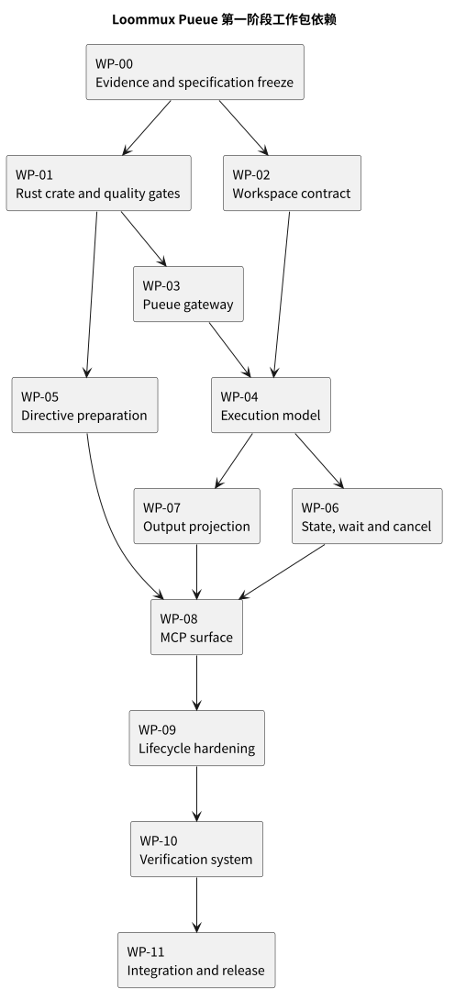

= Loommux Pueue 执行引擎第一阶段交付计划
:doctype: book
:toc: left
:toclevels: 3
:sectnums:
:sectnumlevels: 4
:icons: font
:source-highlighter: rouge
:xrefstyle: short
:experimental:

[abstract]
本文定义 Loommux Pueue 执行引擎第一阶段的工作分解结构、依赖关系、阶段门、交付证据、系统完成标准和系统优秀标准。第一阶段只有在完成标准与优秀标准全部通过后才构成可交付结果。

[#delivery-authority]
== 文档地位

本文是第一阶段工程交付状态的事实源。xref:design-specification.adoc#document-authority[设计规格]定义系统应当是什么；本文将该规格分解为有依赖关系的工作包和可观察验收证据。工作包不得改变设计规格；实现发现规格不可成立时，必须先修订设计决定及其证据，再调整 WBS。

本文所称“完成”是全部 `SYS-DOD-*` 条目通过；“优秀”是全部 `SYS-EXC-*` 条目通过。最终交付条件为二者的逻辑合取，不采用平均分、覆盖率总分或人工主观评价抵消失败项。

文档制品本身的完成与优秀由 xref:documentation-quality-standard.adoc#documentation-authority[文档质量标准]定义，不与系统工程验收合并计分。

[#phase-scope]
== 第一阶段范围

[#phase-objective]
=== 交付目标

第一阶段交付一个可由 MCP host 通过 stdio 启动的 `loommux-pueue` Rust binary。一个 binary process 服务一个 MCP client，维护一个 adapter-local execution namespace，并通过 `pueue-lib` 连接已经运行的 Pueue `v4.0.1` daemon。agent 可以提交 shell script，观察多个并发 execution，读取和搜索保留日志，执行有界等待，并定向取消未启动或已启动 task。

交付包包括：

* `engines/pueue/` Rust crate 与锁定依赖；
* `run_shell`、`status`、`execution_status`、`read_output`、`search_output`、`wait` 和 `cancel` 七个 MCP tools；
* 声明式 workspace config 及既有 Python engine 的一致性迁移；
* 与 Pueue `v4.0.1` / `pueue-lib 0.30.0` 配对的 typed gateway；
* execution 状态投影、combined transcript、控制指令和 result schema；
* pure、component、isolated daemon 和 MCP black-box 四层自动化测试；
* 安装、配置、使用、设计与验证文档；
* 可重复的格式、lint、test、coverage、文档和 diff quality gates。

[#phase-exclusions]
=== 第一阶段明确不交付

下列对象不属于第一阶段：

* Streamable HTTP、SSE 或远程 MCP transport；
* remote/TLS Pueue daemon log collector；
* adapter restart 后的 execution map 恢复；
* daemon startup、shutdown、reset、clean、upgrade 或全局管理工具；
* Pueue group、dependency、priority、schedule、label、pause、resume、stash 或 enqueue surface；
* interactive stdin、PTY、terminal screen 或 shell namespace persistence；
* sandbox、权限隔离、多租户访问控制或配额平台；
* 将 Pueue task ID 公开为第二种 execution 地址；
* 替换既有 Python/IPython engine。

范围外对象不能作为未通过验收项的解释；范围内能力也不能以“可在后续阶段补充”推迟。

[#initial-conditions]
=== 初始条件

工作开始时必须确认：

. `projects/loommux` 当前 Python test、lint 和 type-check 基线可重复；
. Pueue `4.0.1` CLI 与 daemon 可在本机运行；
. Pueue `v4.0.1` tag 和 `pueue-lib 0.30.0` source 可定位；
. Rust stable toolchain、`cargo-nextest`、`cargo-llvm-cov`、Clippy 和 rustfmt 可用；
. `rmcp 3.0.0-beta.2` 的 stdio server API 可通过最小 probe 编译；
. 项目当前 workspace resolver、terminal normalizer、LineLog 和 result policy contract 已建立基线测试；
. 本文档包通过 xref:documentation-quality-standard.adoc#documentation-done[文档完成标准]后，设计才可标记 frozen。

基线失败必须记录为 `BASE-*` issue，并在依赖它的工作包启动前解决。不得把已有失败计入 Pueue engine 的完成结果，也不得在最终报告中忽略。

[#delivery-artifacts]
== 交付制品

[cols="1,3,3", options="header"]
|===
|ID |制品 |验收入口

|ART-01
|`engines/pueue/Cargo.toml`、`Cargo.lock` 和 crate source。
|Cargo metadata、locked build、module audit。

|ART-02
|`loommux-pueue` stdio binary。
|真实 child-process MCP black-box suite。

|ART-03
|声明式 Loommux workspace config schema 与两 engine 一致实现。
|cross-engine workspace contract suite。

|ART-04
|Pueue typed gateway 与 isolated daemon harness。
|Pueue `v4.0.1` integration suite。

|ART-05
|execution record、state projection 和七工具控制闭环。
|design verification matrix `VER-001` 至 `VER-017`。

|ART-06
|combined transcript、normalizer、LineLog、read 和 search。
|design verification matrix `VER-018` 至 `VER-027`。

|ART-07
|MCP content 与 structured result schema。
|schema snapshot 与 black-box assertions。

|ART-08
|测试、coverage report、lint report 和 release verification log。
|quality gate manifest。

|ART-09
|`docs/pueue-engine/` 权威文档包及 README/安装入口迁移。
|AsciiDoc、xref、terminology 和 stale-claim audit。
|===

[#wbs-rules]
== WBS 规则

[#work-package-contract]
=== 工作包字段

每个工作包包含以下字段：

Purpose:: 该工作包建立的系统能力或证据。
Inputs:: 开始工作所需的已冻结规格和已有制品。
Dependencies:: 必须先通过的工作包或阶段门。
Outputs:: 由该工作包唯一负责产生的代码、测试或文档。
Tasks:: 必须完成的工程活动。
Acceptance evidence:: 可以独立检查的通过证据。
Not done when:: 即使 happy path 可运行，也禁止宣称完成的情形。

工作包完成是其全部 acceptance evidence 成立，不是 tasks 被勾选。输出被后续变更破坏时，工作包状态必须从 complete 恢复为 open。

[#dependency-rules]
=== 依赖规则

依赖边表示下游工作包需要上游的稳定 contract 或可执行制品，不表示开发人员只能串行工作。没有直接依赖的包可以并行实现，但只能在各自依赖门通过后声明完成。

不得通过临时复制未冻结类型、mock 不存在的 API 或在测试中硬编码预期 future schema 绕过依赖。探索性 probe 可以先行，但其结果不能作为正式工作包输出，除非被迁移进正式 crate 和测试。

[#dependency-graph]
=== 工作包依赖图

[source,text]
----
WP-00 Evidence and specification freeze
  |
  +--> WP-01 Rust crate and quality gates
  |      |
  |      +--> WP-03 Pueue gateway --------+
  |      |                                 |
  |      +--> WP-05 Directive preparation  |
  |                                        v
  +--> WP-02 Workspace contract -------> WP-04 Execution model
                                             |
                                             +--> WP-06 State/wait/cancel
                                             +--> WP-07 Output projection
                                                        |
                   WP-05 -------------------------------+
                                             |          |
                                             v          v
                                      WP-08 MCP surface
                                             |
                                             v
                                      WP-09 Lifecycle hardening
                                             |
                                             v
                                      WP-10 Verification system
                                             |
                                             v
                                      WP-11 Integration and release
----

[#phase-1-dependency-diagram]
.第一阶段工作包依赖

图只表达完成依赖，不表达人员分配或日历时间。没有直接路径的工作包可以并行，但不得越过其入边对应的稳定 contract。

[#stage-gates]
== 阶段门

[cols="1,2,4", options="header"]
|===
|Gate |名称 |通过条件

|G0
|规格冻结
|证据登记、设计规格、WBS 和文档质量标准一致；所有 blocking open question 已解决；零失效 xref。

|G1
|工程与握手
|正式 Rust crate locked build 成功；真实 isolated `pueued v4.0.1` handshake 和 `Status` exchange 通过。

|G2
|垂直执行路径
|真实 stdio `run_shell` 创建 execution、Pueue task 运行、状态投影和短日志返回成立。

|G3
|七工具闭环
|七个 public tools 在 content 与 structured mode 中通过黑盒主路径；多个 active execution 可独立选择。

|G4
|生命周期硬化
|并发、断连、unknown outcome、cancel race、日志边界、adapter close 和所有设计 verification case 通过。

|G5
|交付
|全部 `SYS-DOD-*`、`SYS-EXC-*`、`DOC-DOD-*` 和 `DOC-EXC-*` 同时通过，release verification 可重复。
|===

任何阶段门失败都会阻止所有依赖该门的 release claim。G5 不允许 waiver。

[#wp-evidence]
== WP-00：证据审计与规格冻结

Purpose::
将讨论材料中的事实、推导、决定、被替代方案和待验证断言转化为具有来源的规范，并建立实现不可绕过的公共词汇和 ID。

Inputs::
原始 Pueue 讨论材料、相邻纯终端调研、现有 Loommux 代码/测试/设计文档、Pueue `v4.0.1` source、目标 `rmcp` source 与本机 probe。

Dependencies::
无。

Outputs::
xref:design-specification.adoc#document-authority[设计规格]、本文、xref:evidence-register.adoc#evidence-policy[证据登记]、xref:documentation-quality-standard.adoc#documentation-authority[文档质量标准]和三张架构/依赖图。

Tasks::

* 为所有重要技术断言建立 `EVD-*` 记录并固定 source locator；
* 明确 Pueue version pairing、task state、wait、log、kill/remove 和 connection 行为；
* 将 CLI wrapper、任意 directive scan、task-ID public surface 和无 session HTTP 等方案记录为 rejected；
* 冻结 `DEC-PUEUE-*`、`VER-*`、`WP-*`、`SYS-DOD-*`、`SYS-EXC-*` ID；
* 审计设计正文中所有 normative term、状态名、工具名和 error kind；
* 关闭所有会改变 public surface 的 open question。

Acceptance evidence::

* G0 所列四份文档和图全部存在；
* `EVD-*` 记录覆盖每项 external behavior claim；
* raw material claim ledger 中每项重要主张被标记 adopted、rejected、superseded 或 out of scope；
* 设计规格 token 数不少于 15,000，且篇幅审计确认没有为达标添加无功能段落；
* AsciiDoc parse、xref、ID uniqueness 和 terminology audit 全部通过。

Not done when::
文档仍引用聊天占位 citation、future protocol date、未经定位的“Pueue 默认行为”，或同一规则在多个文档中给出不同定义。

[#wp-crate]
== WP-01：Rust crate、依赖与质量门禁

Purpose::
建立正式 `engines/pueue/` crate、可执行 binary、locked dependency graph 和从第一行代码开始生效的 Rust quality gates。

Inputs::
xref:design-specification.adoc#system-identity[系统身份与命名]、module map、版本矩阵和项目 Rust toolchain。

Dependencies::
WP-00。

Outputs::
Cargo manifest、lockfile、module skeleton、binary startup、test layout、lint/format/nextest/coverage commands 和 CI integration。

Tasks::

* 创建 package `loommux-pueue` 与 crate `loommux_pueue`；
* exact pin `pueue-lib = "=0.30.0"` 和 `rmcp = "=3.0.0-beta.2"`；
* 只启用运行时需要的 crate features，并用 `cargo deny` 检查来源与 license；
* 建立 `main`、`server`、`adapter`、`execution`、`pueue_gateway`、`workspace`、`directive`、`terminal_text`、`output`、`result`、`error` 模块；
* 配置 `cargo fmt --check`、`cargo clippy --all-targets --all-features -- -D warnings`、`cargo nextest run` 和 `cargo llvm-cov`；
* 建立 deterministic test clock、temporary profile/data directory 和 process cleanup helper 的位置；
* 确保 stdio 上只写 MCP protocol，tracing 写 stderr。

Acceptance evidence::

* `cargo build --locked` 成功；
* binary 可启动并在没有 daemon 时以稳定 startup error 退出；
* tool discovery skeleton 可通过 stdio handshake；
* format、Clippy、nextest、deny 和初始 coverage command 均可运行；
* repository root 和 Python package metadata 未被无关重构。

Not done when::
依赖使用宽松 Pueue protocol version、正式代码仍位于 `tmp/` probe、stdout 混入 tracing、或 quality commands 只记录在聊天中而没有仓库入口。

[#wp-workspace]
== WP-02：Workspace 与启动配置

Purpose::
建立跨 engine 的声明式 workspace contract，使 Pueue `AddRequest.path` 和既有 IPython kernel workspace 由同一规则解释。

Inputs::
xref:design-specification.adoc#workspace-contract[Workspace contract]、现有 `host_workspace_config.py`、workspace examples 和 tests。

Dependencies::
WP-00；Pueue Rust implementation 依赖 WP-01，Python migration 可以在 WP-01 并行准备。

Outputs::
versioned TOML schema、Rust resolver、Python resolver migration、generic/Codex examples、cross-engine fixtures 和 startup error taxonomy。

Tasks::

* 实现 `version = 1`、`launch_cwd` 与 `nearest_ancestor_containing_marker`；
* 验证 absolute config path、marker、marker type、fallback 和 resolved directory；
* 将现有 Python callback resolver 迁移到同一 TOML contract，删除一个环境变量两种文件语言的长期歧义；
* 更新 examples，使 Codex marker 规则显式由 host 配置授权；
* 保证 workspace 只在 startup 解析一次；
* 在两个 engine 的 status 中使用 `launch_cwd` / `explicit_config` 相同 authored surface；
* 建立路径、symlink、root、marker missing、file/directory mismatch 和 malformed TOML tests。

Acceptance evidence::

* 同一 fixture/config 在 Python 与 Rust resolver 中返回相同 canonical path 和 resolution；
* 配置错误在 tool ready 前失败且不 silent fallback；
* Pueue integration test 证明 `AddRequest.path` 等于 resolved workspace；
* repository search 不再宣称 `LOOMMUX_WORKSPACE_CONFIG` 必然执行 Python file；
* migration note 明确旧 resolver 的替换方式，但当前对象定义不含版本历史叙述。

Not done when::
两个 engine 对同一环境变量使用不同 grammar、Rust 自动扫描 `.git`/`.codex`、工具允许逐次 cwd override，或错误配置静默使用 launch cwd。

[#wp-gateway]
== WP-03：Pueue Gateway 与 isolated daemon harness

Purpose::
建立唯一 typed protocol boundary，并证明目标 library 与真实 daemon 的连接、request/response 和 failure behavior。

Inputs::
xref:design-specification.adoc#pueue-gateway[Pueue Gateway 与协议边界]、Pueue `v4.0.1` source 与 crate pairing evidence。

Dependencies::
WP-00、WP-01。

Outputs::
`PueueGateway`、settings/secret loading、atomic exchange、typed operations、connection invalidation/reconnect 和 isolated daemon test harness。

Tasks::

* 使用 `pueue-lib::Client` 建立 async connection；
* 将 send/receive 包装为一个 mutex-protected exchange；
* 为 Add、Status、Remove 和 Kill 建立 typed operation；
* 验证每项 expected response variant；
* 分类 explicit failure、I/O failure、timeout、protocol mismatch、unexpected response 和 outcome unknown；
* 实现只读 operation 的一次受控 reconnect；
* 禁止 side-effect operation 自动重放；
* test harness 使用独立 settings、secret、socket、data directory 和 daemon process；
* 所有测试退出路径回收 harness daemon，不操作用户真实 daemon。

Acceptance evidence::

* G1 真实 handshake 与 Status exchange 通过；
* concurrent exchange test 证明 response 不交错；
* unexpected response 使 connection unusable；
* Add response loss 不产生自动第二 task；
* 只读 reconnect test 恢复 observation；
* test harness 结束后没有残留 daemon/process/socket/data directory。

Not done when::
实现 shell-out CLI、mutex 只保护 send、Pueue failure text 被当作稳定 error kind、测试连接用户 daemon，或断连后一律重放 request。

[#wp-execution-record]
== WP-04：Execution record、编号与状态投影

Purpose::
建立 adapter-local execution namespace、task binding、唯一公共状态集合和 backend missing behavior。

Inputs::
xref:design-specification.adoc#identity-model[双层标识模型]、xref:design-specification.adoc#execution-model[Execution 状态模型]、Pueue typed task state。

Dependencies::
WP-00、WP-01、WP-02 的 Rust workspace API、WP-03 的 Add/Status operation。

Outputs::
`PueueMCPAdapter` core、`PueueExecution`、sequence/map/recent/active logic、submission atomicity、state/result projection 和 fake-gateway component suite。

Tasks::

* 实现从 1 开始、accepted-only advance 的 execution sequence；
* 在 `AddedTaskResponse` 后原子发布 task binding；
* 保持 task ID private；
* 投影 Locked、Stashed、Queued、Running、Paused 与全部 Done result；
* 区分 completed、failed、killed、cancelled 和 backend task missing；
* 保存 public lifecycle metadata，不保存 request archive、environment 或 secret；
* 使用单次 Status snapshot 刷新多个 local execution；
* 保证 recent 与 active collection 规则稳定；
* 建立 execution overflow 的 deterministic startup/runtime error，禁止 wrap 或复用。

Acceptance evidence::

* `VER-001` 至 `VER-008` 与 `VER-017` 通过；
* property test 对任意 accepted/rejected sequence 证明 public ID 单调且无重复；
* state projection exhaustive match 在 Pueue enum 新增 variant 时造成 compile failure；
* response snapshot 不含 task ID 和 private fields；
* 两 adapter fixture 中 execution namespace 相互独立。

Not done when::
task ID 进入 public schema、rejected Add 消耗编号、使用 scalar current execution、unknown task 被猜测为 killed，或状态映射散落在多个 tool handler。

[#wp-directive]
== WP-05：控制指令与提交准备

Purpose::
建立无歧义、消耗型 shell control preamble，并保证无效请求在任何 backend 或 execution side effect 前失败。

Inputs::
xref:design-specification.adoc#control-directives[Shell 控制指令]、既有 Loommux directive contract 和 Freeform MCP input pattern。

Dependencies::
WP-00、WP-01。

Outputs::
`PreparedRunShell`、preamble scanner、option validator、exact range deletion 和 directive unit/property tests。

Tasks::

* 识别首个普通 source line 之前的 column-zero `# loommux:`；
* 解析唯一 `--wait` 与 `--full-output`；
* 验证 positive finite decimal、unknown、duplicate 和 missing values；
* 从同一 scan result 生成 resolved policy 与 deletion ranges；
* 删除 active line 及其自身 line terminator，不插入 padding；
* 保留 leading empty line、普通 shell comment、here-document 和首个 source line 后的 directive-shaped text；
* 拒绝 clean script 为空；
* 只将 full-output private policy 传入 execution creation；
* 覆盖 LF、CRLF、final no newline、multiple directives、large decimal 和 non-finite inputs。

Acceptance evidence::

* `VER-003`、`VER-025` 至 `VER-027` 通过；
* fuzz/property test 证明删除结果等于原输入删除已报告 ranges，未修改其他字节；
* invalid request 的 fake gateway call count 为零，sequence/recent 不变；
* parser 和 remover 不存在重复 prefix matching logic。

Not done when::
扫描任意 script 行、here-document 数据被消费、directive 进入 `AddRequest.command`、删除产生空白占位，或 `--wait` 被持久保存在 execution record。

[#wp-control]
== WP-06：状态刷新、有界等待与取消

Purpose::
建立 execution lifecycle 的主动观察和定向控制，使多个 active execution 在不互相阻塞的情况下独立 wait 或 cancel。

Inputs::
xref:design-specification.adoc#execution-lifecycle[Execution lifecycle]、xref:design-specification.adoc#wait-tool[`wait`]、xref:design-specification.adoc#cancel-tool[`cancel`]。

Dependencies::
WP-03、WP-04；run_shell initial wait integration 还依赖 WP-05。

Outputs::
single/multi execution refresh、monotonic deadline wait loop、state-sensitive cancel、race handling、component tests 和 isolated daemon control tests。

Tasks::

* 使用一次 Status response 刷新目标 execution 或本地 execution 集合；
* 实现 timeout validation、monotonic deadline、first observation 和两秒上限 polling interval；
* 保证 sleep 期间释放 gateway mutex；
* 为 locked/stashed/queued/running/paused 定义一致 nonterminal wait；
* 对 queued/stashed 使用 task-specific Remove 并建立 local cancelled terminal record；
* 对 running/paused 使用 task-specific Kill，区分 request accepted 与 later killed；
* 对 locked、terminal、backend missing 和 refresh/control race 返回规定结果；
* side-effect response loss 返回 outcome unknown，不自动重放；
* cancel selection 始终为单个 task ID，禁止 group/all；
* wait/cancel 后刷新输出，但输出失败不改写 lifecycle result。

Acceptance evidence::

* `VER-009` 至 `VER-017` 全部通过；
* deterministic clock unit tests 不依赖真实两秒 sleep；
* isolated daemon tests 使用真实时间验证 polling 与 task continuation；
* long wait 与 concurrent Add/Status/Read/Kill exchange 无 deadlock；
* cancel race 每个 response branch 都有直接测试；
* gateway operation log 证明没有 group/all control request。

Not done when::
wait deadline 会 kill task、wait 持锁 sleep、queued task 无法取消、kill success 被直接标记 killed、control request 自动重放，或 cancel 可能影响同 group 的其他 task。

[#wp-output]
== WP-07：日志同步、文本规范化、读取与搜索

Purpose::
将 Pueue combined task log 转化为稳定、append-only、可重复读取和搜索的 agent 文本对象。

Inputs::
xref:design-specification.adoc#output-model[输出模型]、既有 Python `TerminalTextNormalizer`、`LineLog` contract 和 Pueue log helpers。

Dependencies::
WP-01、WP-02 提供 settings/data path，WP-04 提供 task binding；terminal normalizer 与 LineLog pure implementation 可并行开始。

Outputs::
Rust terminal normalizer、incremental UTF-8 decoder、`OutputCollector`、`LineLog`、range parser、search engine、共享测试向量和真实 log integration tests。

Tasks::

* 从 Pueue settings 解析 task log path，不硬编码用户目录；
* 保存 byte offset、UTF-8 tail、escape-sequence state 和 partial final line；
* 增量读取新增 bytes，禁止重复规范化完整日志；
* 处理 log-not-yet-created、read failure、short read、growth、replacement/truncation 和 terminal EOF；
* 移除 ANSI CSI、OSC 与其他 terminal formatting；
* 规范化 carriage return/backspace，保留业务 Unicode、newline 和 tab；
* 实现 inclusive `start:stop`、negative endpoints、omission counts 和 per-line clipping；
* 实现 literal/regex/auto、case、context 和 overlapping context deduplication；
* 在 Rust 与 Python contract suites 中运行同一 normalization/range/search fixtures；
* 验证大日志只影响内部 transcript storage，不使自动 MCP response 无边界增长。

Acceptance evidence::

* `VER-018` 至 `VER-025` 全部通过；
* 1-byte chunk property suite 覆盖每个 ANSI/UTF-8 test vector 的所有切分位置；
* 多次 refresh 后 transcript 等于一次完整 normalization 的结果；
* 10 MiB mixed-output integration fixture 无重复或丢失，普通 terminal response 仍遵守 300 行限制；
* log offset 回退产生稳定 error，不静默重建；
* read/search 不消费历史，同一范围重复读取相同。

Not done when::
输出经 CLI 获取、每次重新读取并规范化完整日志、ANSI 残片泄漏、stdout/stderr 被伪造为独立历史、partial line 导致既有行号变化，或大日志直接塞入普通 tool response。

[#wp-mcp]
== WP-08：MCP 七工具与结果投影

Purpose::
将 adapter control plane 暴露为稳定 MCP schema，并保证 content 与 structured result 对同一 execution 给出一致事实。

Inputs::
xref:design-specification.adoc#tool-control-loop[七工具控制闭环]、xref:design-specification.adoc#result-surface[结果表面]、WP-04 至 WP-07 adapter APIs。

Dependencies::
WP-01、WP-04、WP-05、WP-06、WP-07。

Outputs::
rmcp tool router、typed parameters、tool descriptions、content formatter、structured schema、CLI result mode 和 stdio black-box fixture。

Tasks::

* 注册且只注册七个规范工具；
* 将 execution-specific 参数声明为 required positive integer；
* 为 wait、range、query、context 和 max chars 提供准确 schema constraints；
* tool description 使用对象语言，说明 output、timeout 和 control boundary；
* content formatter 在所有状态下使用相同术语和字段选择；
* structured mode 复用同一 observation object，禁止独立重算状态；
* tool error 与 terminal task failure 使用不同 `ok` 语义；
* stdout 只承载 MCP framing，stderr 承载 tracing；
* default result mode 为 content，explicit structured mode 同时返回 content 与 structuredContent；
* schema snapshot 防止参数 optionality、名称和 error surface 漂移。

Acceptance evidence::

* tool discovery 精确返回七个名称；
* content/structured black-box 对 `VER-001`、`VER-007`、`VER-009`、`VER-012`、`VER-013`、`VER-024` 产生一致状态；
* structured schema 不含 task ID、environment、secret、private directive policy 或其他 adapter task；
* malformed MCP arguments 在 adapter side effect 前失败；
* stdio framing test 证明 tracing 不污染 protocol。

Not done when::
tool handler 直接操作 Pueue client、content 与 structured mode 状态不一致、execution 参数可省略、额外暴露 restart/clean/pause 等工具，或 tool docstring 依赖聊天历史才能理解。

[#wp-lifecycle]
== WP-09：启动、关闭、断连与异常路径硬化

Purpose::
保证 process、connection、task、execution 和 log 的不同生命周期在正常退出与故障中仍保持所有权边界。

Inputs::
xref:design-specification.adoc#ownership[对象所有权]、xref:design-specification.adoc#connection-failures[连接失败与重连]、stdio session contract。

Dependencies::
WP-03、WP-04、WP-06、WP-07、WP-08。

Outputs::
startup state machine、shutdown order、panic/error boundary、child-process black-box tests、task persistence tests 和 resource leak checks。

Tasks::

* startup 按 config、workspace、settings、secret、connection、handshake、adapter、tool-ready 顺序执行；
* 任一 startup failure 在工具可用前退出并保留稳定 error category；
* shutdown 停止接收 MCP request，等待正在结束的短 exchange，关闭 connection 并释放 local records；
* shutdown 不发送 daemon shutdown、reset、clean、remove 或 kill；
* panic 不打印 secret、environment 或 full script；
* runtime connection invalidation 与 reconnect 不改变 execution sequence/map；
* unknown side-effect outcome 在后续工具中保持可诊断，不自动制造 binding；
* 外部 remove/clean/reset 的 task missing 只改变 backend presence；
* SIGTERM、stdin EOF、MCP client abrupt close 和 normal close 使用同一 ownership rule；
* test harness 验证 server 与 daemon 两类 process 均按各自 owner 清理。

Acceptance evidence::

* `VER-030` 至 `VER-033` 全部通过；
* server 退出后已提交 long task 仍可由独立 Pueue CLI 观察并完成；
* adapter close trace 中没有 state-changing daemon request；
* repeated black-box suite 后无 `loommux-pueue`、isolated `pueued`、socket 或临时 data directory 泄漏；
* panic/error snapshots 不含 sensitive fields。

Not done when::
adapter close 清理 task、startup failure 后仍部分暴露工具、断连清空 execution map、测试残留 daemon，或异常日志泄露 secret/environment/script。

[#wp-verification]
== WP-10：自动化验证系统

Purpose::
把设计规格中的每项公共状态、错误、竞态和边界转化为可重复证据，并建立不会因单一 happy path 通过而误报完成的门禁。

Inputs::
xref:design-specification.adoc#verification-contract[验证契约]、WP-01 至 WP-09 outputs。

Dependencies::
WP-01 至 WP-09。test fixtures 可以随各工作包同步建设；WP-10 completion 要求全部集成。

Outputs::
pure/component/integration/black-box suites、coverage config、test manifest、flaky repetition runner 和 requirement-to-test traceability report。

Tasks::

* 为 `VER-001` 至 `VER-035` 建立唯一 automated test mapping；
* 建立 deterministic fake clock、script fixtures、daemon harness 和 MCP client harness；
* exhaustive 测试 Pueue status/result projection 与 public error kind；
* property/fuzz 测试 directive ranges、LineLog ranges、search context、normalizer chunk boundaries 和 ID monotonicity；
* 并发测试 gateway exchange、wait sleep、multiple adapter namespace 和 cancel race；
* fault injection 覆盖 send-before-disconnect、response loss、unexpected response、log truncate 和 task removal；
* 生成 line/function/region coverage；
* 对标记 integration/black-box 的 tests 使用 nextest group 控制隔离资源，不通过全局串行掩盖不必要锁；
* 测试失败保存最小可诊断日志，但不保存 secret 或完整 environment；
* 以 20 次重复运行检查并发套件稳定性。

Acceptance evidence::

* `VER-001` 至 `VER-035` traceability coverage 为 100%；
* public error kind test coverage 为 100%；
* Done result 和 nonterminal TaskStatus variant coverage 为 100%；
* crate line coverage 不低于 90%、function coverage 不低于 95%、region coverage 不低于 85%；
* critical modules `directive`、`execution`、`pueue_gateway` response mapping 和 `output` failure branches 具有直接行为测试；
* concurrency suite 连续 20 次通过，无 timeout、deadlock、resource leak 或 namespace leakage；
* test command 在 clean checkout 中可由一个 documented entrypoint 重复。

Not done when::
coverage 达标但 verification matrix 有 unmapped case、真实 daemon 行为只由 mock 推断、并发测试依赖 sleep 猜测、flaky test 被 skip，或失败制品泄露 sensitive data。

[#wp-release]
== WP-11：集成、文档迁移与发布验证

Purpose::
将 Rust engine、Python workspace migration、文档、安装入口和 quality gates组合成一个无冲突的可交付包。

Inputs::
WP-00 至 WP-10 outputs、项目 README、pyproject/Cargo distribution strategy、现有 CI 和 release conventions。

Dependencies::
WP-00 至 WP-10；只有所有上游 acceptance evidence 仍通过时可以完成。

Outputs::
README 与安装说明、engine selection说明、配置示例、release checklist、最终 verification log、变更记录和 scoped commit。

Tasks::

* 在项目 README 中定义 IPython 与 Pueue engine 的不同执行世界和选择入口；
* 记录 `pueued 4.0.1` 前置条件、binary 启动、result mode 和 workspace config；
* 提供短 task、长 task、read/search/wait/cancel 示例，但不把示例写成第二份规范；
* 更新所有与 Python resolver、terminal output 和 control directive 相关的冲突文档；
* 建立 Rust binary 的本地安装和 release packaging 路径；
* 执行 Python 与 Rust 全量 quality commands；
* 执行 AsciiDoc parse、xref、link、ID、terminology、stale claim 和 generated diagram checks；
* 运行 clean checkout end-to-end：启动 isolated daemon、启动 MCP server、执行七工具 workflow、关闭 server、确认 task ownership；
* 使用 `git diff --check`、scope audit 和 secret scan；
* 生成最终 requirement/decision/work-package/test traceability report。

Acceptance evidence::

* G5 全部条件通过；
* clean checkout 按文档命令可以构建、测试并启动；
* README 与权威设计之间无重复冲突规则；
* repository-wide search 无旧 Python resolver grammar、公开 task ID、current execution、CLI wrapper 或 adapter-owned daemon 陈述；
* release log 记录工具版本、命令、exit code 和 coverage 数字；
* commit 只包含 Pueue engine、跨 engine workspace contract、直接受影响测试与文档。

Not done when::
只有开发者本地隐式状态可运行、文档示例与 tool schema 不符、旧文档保留相反规则、generated diagrams 过期、quality command 未执行，或提交混入无关项目变更。

[#system-done]
== 系统完成标准

完成标准是第一阶段不可缺少的功能、契约和证据。下列条目必须全部为 true：

[cols="2,6", options="header"]
|===
|ID |判定条件

|SYS-DOD-001
|`engines/pueue/` 为正式 Rust crate，`cargo build --locked` 产生 `loommux-pueue` binary。

|SYS-DOD-002
|目标 `pueued 4.0.1` 与 exact `pueue-lib 0.30.0` 完成真实 handshake；不使用 CLI wrapper。

|SYS-DOD-003
|stdio MCP 精确暴露七个规范工具，参数 required/optional surface 与设计一致。

|SYS-DOD-004
|每个 adapter execution 从 1 开始，accepted-only advance，严格递增且不复用。

|SYS-DOD-005
|execution 发布时已经绑定 task；task ID、secret、environment 和其他 adapter task 不进入公共 schema。

|SYS-DOD-006
|Locked、Stashed、Queued、Running、Paused 和全部 Done result 的公共投影完整且唯一。

|SYS-DOD-007
|不存在 current execution；所有 specific tool 要求显式 execution。

|SYS-DOD-008
|run_shell initial wait 与 wait deadline 只限制 observation，不改变 task。

|SYS-DOD-009
|queued/stashed cancel 进入 cancelled；running/paused cancel 请求 kill 并稍后观察 killed；其他状态行为明确。

|SYS-DOD-010
|combined transcript 增量读取、可重复 read/search、行坐标稳定且不消费历史。

|SYS-DOD-011
|所有公开输出通过跨 chunk ANSI/UTF-8 terminal normalization。

|SYS-DOD-012
|普通 terminal 自动输出遵守 300 行限制，`--full-output` 在稍后 wait 中仍有效。

|SYS-DOD-013
|control preamble 只在 leading 区域识别、验证后完全删除，无效输入零 side effect。

|SYS-DOD-014
|workspace TOML contract 在 Python 与 Rust engine 中一致，配置失败阻止 tool ready。

|SYS-DOD-015
|gateway exchange 原子，poll sleep 不持锁，side-effect unknown outcome 不自动重放。

|SYS-DOD-016
|adapter close 不 shutdown/reset/clean daemon，也不停止已提交 task。

|SYS-DOD-017
|设计 `VER-001` 至 `VER-035` 全部具有自动化测试并通过。

|SYS-DOD-018
|line coverage >= 90%、function coverage >= 95%、region coverage >= 85%，且无 verification mapping 缺口。

|SYS-DOD-019
|rustfmt、Clippy `-D warnings`、nextest、llvm-cov、cargo-deny、Python tests/lint/type-check 和 `git diff --check` 全部通过。

|SYS-DOD-020
|README、安装、配置、示例、设计、WBS、证据和质量标准一致，零 stale conflicting claim。
|===

任一 `SYS-DOD` 失败时，系统状态为未完成。不得使用“核心功能完成”“只差文档”“测试随后补”或覆盖率平均值声明完成。

[#system-excellence]
== 系统优秀标准

优秀标准建立在全部完成标准已经通过的前提上。下列条目也必须全部为 true：

[cols="2,6", options="header"]
|===
|ID |判定条件

|SYS-EXC-001
|每个公共状态转换、Done result 和 public error kind 至少有一个直接测试，不依赖邻近路径推断。

|SYS-EXC-002
|directive scan result 同时供应 validation 与 deletion ranges，仓库中不存在第二套 active-line matching logic。

|SYS-EXC-003
|Pueue state projection 由一个 exhaustive function 定义；tool、result 和 presentation 层不重复 match backend enum。

|SYS-EXC-004
|gateway mutex 的最大语义范围是一轮 request/response；代码审计和并发测试同时证明 sleep、log I/O、normalization 与 formatting 均在锁外。

|SYS-EXC-005
|四个 adapter 各创建八个 execution，同时运行 wait、status、read 和 cancel 的场景连续 20 次通过，无 deadlock、ID 泄漏、response 交错或误取消。

|SYS-EXC-006
|所有 Add/Remove/Kill response-loss fault injection 均证明不自动重放，并保留可诊断 unknown outcome。

|SYS-EXC-007
|terminal normalizer 对每个测试向量的全部 byte split position 通过；Rust 与 Python 输出契约一致。

|SYS-EXC-008
|10 MiB mixed combined log 无重复、无丢失、无既有行号漂移，普通 MCP response 仍有界。

|SYS-EXC-009
|crate line coverage >= 95%、function coverage = 100%、region coverage >= 90%；排除项只允许第三方 macro/generated code，并有书面清单。

|SYS-EXC-010
|真实 daemon integration 覆盖 success、所有 failure result、queued/running/paused control、external removal、disconnect 和 adapter close task persistence。

|SYS-EXC-011
|运行完整 test suite 后无残留 server、isolated daemon、socket、temporary profile、task log 或 child process。

|SYS-EXC-012
|所有代码注释说明所有权、竞态、协议或不可见约束；零注释仅复述函数、分支或赋值。

|SYS-EXC-013
|实现 diff 只涉及 engine、workspace contract、直接测试、文档和构建入口；不存在机会性重构。

|SYS-EXC-014
|reviewer 可以从每个 `DEC-PUEUE` 和 `SYS-DOD/EXC` 追踪到模块、测试和 evidence，不依赖聊天记录。

|SYS-EXC-015
|clean checkout release verification 连续执行两次产生相同 tool schema、测试结果、coverage gate结论和 generated diagram diff。
|===

优秀标准不是 optional stretch goal。G5 要求 `SYS-DOD` 与 `SYS-EXC` 同时全部通过。

[#acceptance-equation]
== 最终验收公式

[source,text]
----
ENGINE_ACCEPTED =
    all(SYS-DOD-001 .. SYS-DOD-020)
    AND all(SYS-EXC-001 .. SYS-EXC-015)
    AND all(DOC-DOD)
    AND all(DOC-EXC)
    AND G0..G5 remain reproducibly green
----

不采用 waiver、平均分或“已知问题不影响主要功能”的替代规则。任何条目因后续修改失效，最终验收立即失效，直到证据重新通过。

[#delivery-review]
== 交付审查问题

最终 reviewer 必须能够对下列问题全部回答“是”：

. 是否能从一个 clean checkout 构建并启动 `loommux-pueue`？
. 是否能证明每个 execution 只属于创建它的 adapter？
. 是否能证明 task ID 和 daemon-global state 没有成为未设计的公共 surface？
. 是否能在 wait 运行期间继续提交、读取和取消其他 execution？
. 是否能取消尚未启动与已经启动的 task，并区分 cancelled 与 killed？
. 是否能重复读取和搜索运行中及已终态的同一 transcript？
. 是否能证明 adapter 退出不会终止 task 或关闭 daemon？
. 是否能在 response loss 时避免重复 Add/Remove/Kill？
. 是否能由自动化证据覆盖所有设计 verification case？
. 是否能在不读取聊天记录的情况下解释每项设计决定和实现边界？

任一回答为“否”“未测试”“理论上可以”或“目前没有遇到问题”，均表示第一阶段未达到 G5。
